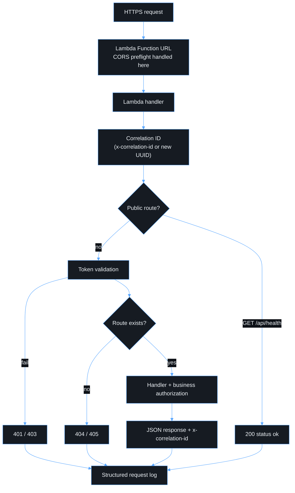

# API

- **Base URL:** the Lambda Function URL (`https://<id>.lambda-url.<region>.on.aws`).
- **Authentication:** `Authorization: Bearer <Entra v2 access token>` with the
  `access_as_user` scope.

## Request lifecycle



Unknown paths are authenticated **before** a 404 is returned, so anonymous
callers cannot enumerate routes.

## Endpoints

### `GET /api/health` (public)

```json
{ "status": "ok" }
```

This endpoint never exposes configuration, versions or dependency status.

### `GET /api/me` (protected)

This is a diagnostic bootstrap endpoint. It returns an allow-listed projection
of the validated identity and never the raw token.

```json
{
  "oid": "…",
  "tenantId": "…",
  "scopes": ["access_as_user"],
  "roles": [],
  "name": "Ada Lovelace"
}
```

## Errors

Every error has the same shape:

```json
{ "error": { "code": "unauthorized", "message": "…", "correlationId": "…" } }
```

| Status | `code`               | Meaning                                                                   | Header                                           |
| ------ | -------------------- | ------------------------------------------------------------------------- | ------------------------------------------------ |
| 401    | `unauthorized`       | Missing, malformed, expired, wrong issuer/audience/tenant/signature       | `WWW-Authenticate: Bearer error="invalid_token"` |
| 403    | `forbidden`          | Missing `access_as_user` scope or business rule denied                    | `insufficient_scope` for scope failures          |
| 404    | `not_found`          | Unknown route (only after authentication)                                 |                                                  |
| 405    | `method_not_allowed` | Known route, wrong method                                                 | `Allow`                                          |
| 500    | `internal_error`     | Unexpected failure. Details are only in the logs, found by correlation ID |                                                  |

Every response carries `x-correlation-id` and `cache-control: no-store`.

## CORS

CORS is set on the Function URL, not in code. Allowed origins come from the
environment config and are never `*`. The allowed methods are `GET` and
`POST`. The allowed headers are `authorization`, `content-type` and
`x-correlation-id`. Credentials are disabled because tokens travel in headers,
not cookies.
