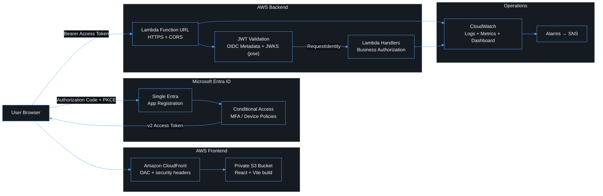

# Architecture

This is the as-built architecture for friendly-funicular: a React 19 + Vite
single-page application that signs users in with Microsoft Entra ID (MSAL,
Authorization Code + PKCE) and calls an AWS Lambda Function URL. The function
validates the Entra access token itself before any business logic runs. There
is no Cognito, no Amplify and no client secret anywhere. The original design
intent and rationale are in [`../plan.md`](../plan.md).

## Overview

The system has two planes that deploy and fail independently. The
**frontend plane** is static files in a private S3 bucket, served only through
CloudFront with Origin Access Control. The **backend plane** is one Lambda
function behind a public Function URL (`AuthType: NONE`). Its first protected
step is JWT validation against the tenant's OIDC metadata and JWKS.

The critical trust boundary: **Entra issues the token → the browser sends it to
the Function URL → Lambda validates it → business logic trusts only the
validated `RequestIdentity`.**

## Repository layout

| Path              | Responsibility                                                       |
| ----------------- | -------------------------------------------------------------------- |
| `apps/web`        | React/Vite SPA: MSAL auth layer, routing, API client, pages          |
| `apps/api`        | Lambda handler: token validation, authorization, structured logging  |
| `packages/shared` | Types and constants shared by SPA and API (`MeResponse`, scope name) |
| `infra`           | CDK v2: `BackendStack`, `FrontendStack`, `ObservabilityStack`        |
| `docs`            | This documentation set and ADRs                                      |
| `.github`         | CI (quality gates) and CD (OIDC-federated deploy + smoke tests)      |

## Deliberate constraints

- **One tenant, one app registration** for the SPA and the API. See
  [ADR 0001](adr/0001-single-entra-registration.md) for the trade-off and the
  triggers that require splitting it.
- **Direct Function URL.** No API Gateway. Lambda therefore owns token
  validation, and abuse and cost exposure are handled with reserved
  concurrency, alarms and CORS. See [security.md](security.md).
- **No VPC.** The function only calls public Entra endpoints. See
  [infrastructure.md](infrastructure.md#networking).

Related: [authentication](authentication.md) · [authorization](authorization.md) ·
[API](api.md) · [Lambda](lambda.md) · [infrastructure](infrastructure.md) ·
[security](security.md) · [observability](observability.md) · [CI/CD](ci-cd.md) ·
[deployment](deployment.md) · [testing](testing.md) ·
[troubleshooting](troubleshooting.md) · [Well-Architected](well-architected.md)
