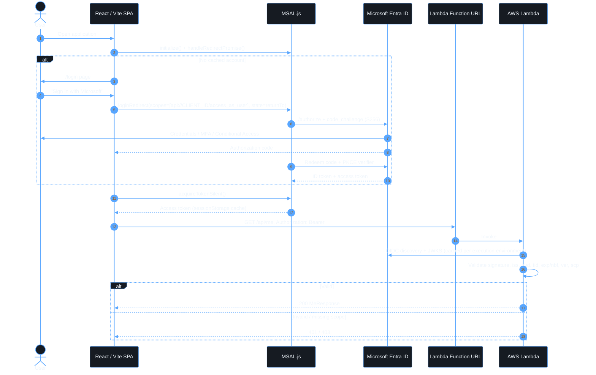
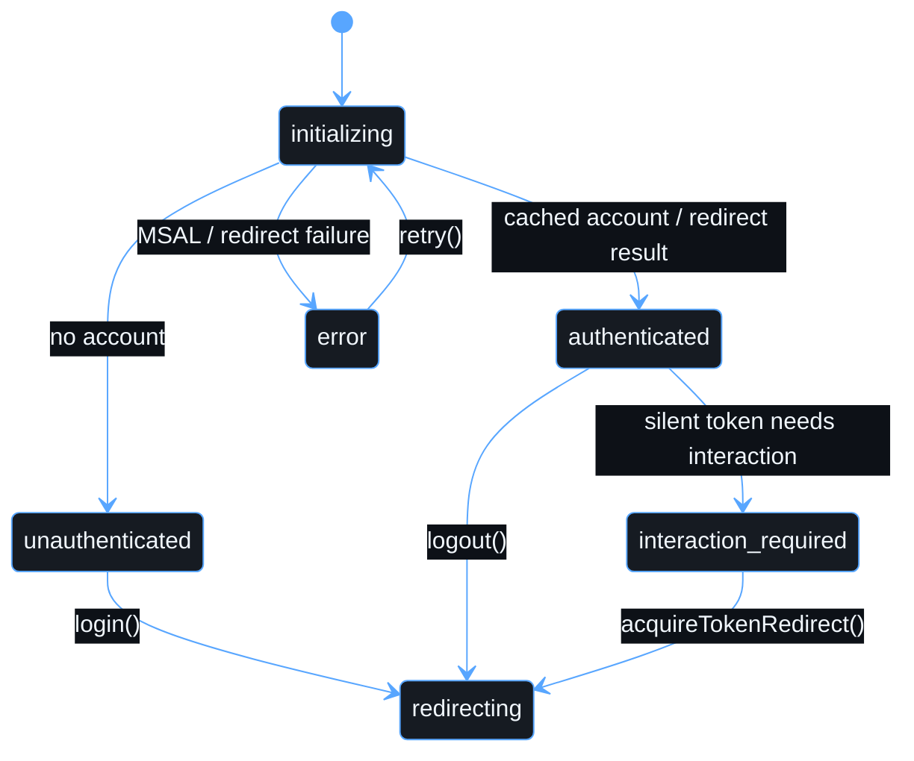

# Authentication

The SPA is a **public client**. MSAL (`@azure/msal-browser` +
`@azure/msal-react`) runs OAuth 2.0 Authorization Code Flow with PKCE against
the tenant-specific authority `https://login.microsoftonline.com/<TENANT_ID>`.
Credentials, MFA and Conditional Access are all handled on Microsoft-hosted
pages. The application never renders credential fields.

## Frontend modules

| Module                         | Responsibility                                                                                 |
| ------------------------------ | ---------------------------------------------------------------------------------------------- |
| `src/config/environment.ts`    | Reads and validates `VITE_*`. Rejects `common`, non-HTTPS APIs and scope mismatches            |
| `src/auth/auth-config.ts`      | MSAL configuration, login request and `sanitizeReturnTo` (open-redirect guard)                 |
| `src/auth/auth-provider.tsx`   | One-time MSAL bootstrap and the explicit auth state machine                                    |
| `src/auth/use-auth.ts`         | `AuthContext` and the `useAuth()` hook                                                         |
| `src/auth/token-service.ts`    | `acquireTokenSilent`, falling back to `acquireTokenRedirect` only when interaction is required |
| `src/auth/protected-route.tsx` | UX gate for session-only routes. Not a security boundary                                       |
| `src/api/api-client.ts`        | Adds the bearer token, correlation IDs, error mapping and retries                              |

## Session states

The UI never flashes protected content. Routing decisions wait for
initialization to finish.

## Key decisions

- **`loginRedirect` / `acquireTokenRedirect`**, not popups. Redirects are more
  reliable under Conditional Access and popup blockers.
- **`sessionStorage` token cache.** Tokens last only for the browser tab
  session. Changing this is a security trade-off, so record it in
  [security.md](security.md) first.
- **Access tokens only go to the API.** The ID token is never sent as a credential.
- **Refreshing the page** restores the session through the MSAL cache and
  silent acquisition, without a visible login.
- **Return path.** The requested path is carried in the OAuth `state`. It is
  sanitized to a same-origin relative path before it is honoured.
- Tokens are never logged. MSAL PII logging is disabled.
