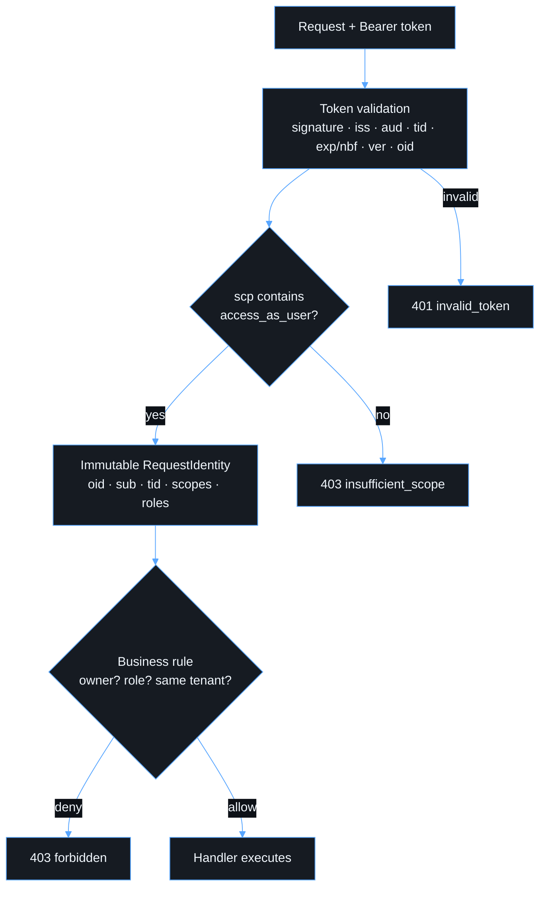

# Authorization

Authorization happens in two separate Lambda steps. Neither step trusts the browser.

1. **Admission (token validation).** Is this an authentic Entra v2 access
   token from our tenant, for our API, still valid, and carrying
   `access_as_user`? The code is in `apps/api/src/auth/token-validator.ts`.
2. **Business authorization.** Can this validated identity perform this
   operation on this resource? The code is in `apps/api/src/auth/authorization.ts`.

## Rules

- Only **stable claims** are used: `oid`, `sub`, `tid`, `scp`, `roles`.
- `email`, `preferred_username`, UPN and display name are **never** used for
  authorization. `name` is carried for presentation only.
- Handlers receive the normalized `RequestIdentity`, never the raw token.
- The frontend `ProtectedRoute` only affects the user experience.

## Helpers

| Helper                                        | Semantics                                                            |
| --------------------------------------------- | -------------------------------------------------------------------- |
| `hasScope` / `requireScope`                   | Delegated scope check (`403 insufficient_scope`)                     |
| `hasRole` / `requireRole` / `requireAnyRole`  | Entra app-role check (`roles` claim)                                 |
| `canAccessResource` / `requireResourceAccess` | Owner (`oid`) or optional admin role; **cross-tenant always denied** |

## Adding app roles

When different privilege levels are needed, define **app roles** on the
registration (for example `Admin`, `Reader`) and assign them to users or
groups. Then call `requireRole` in the handler. Do not hard-code users or
emails. Every new rule needs positive and negative tests in
`apps/api/test/authorization.test.ts`.
