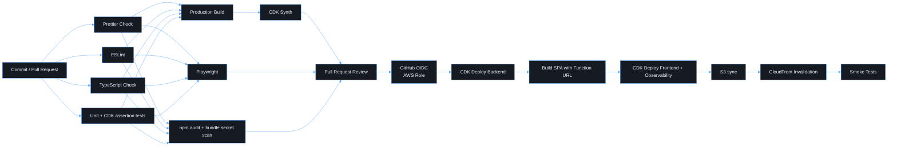

# CI/CD

## CI — `.github/workflows/ci.yml`

This runs on every pull request and every push to `master`/`main`. It never
modifies source files. Jobs: **quality** (format check, lint, typecheck,
tests with coverage) → **build** (API + SPA bundles, `cdk synth`), **e2e**
(Playwright login flow with stubbed Entra) and **security** (`npm audit`,
secret scan of the SPA bundle). It uses public placeholder Entra GUIDs.

## CD — `.github/workflows/deploy.yml`

This runs on push to `master`/`main` (targeting `dev`) or by manual dispatch
(`dev`, `test`, `prod`). It authenticates to AWS with **GitHub OIDC**; there
are no stored AWS keys.

### One-time setup

1. Create the GitHub OIDC identity provider in the AWS account
   (`token.actions.githubusercontent.com`).
2. Create a deploy role whose trust policy is limited to this repository and
   environment:
   `"token.actions.githubusercontent.com:sub": "repo:<owner>/friendly-funicular:environment:<env>"`.
   Scope its permissions to CDK bootstrap roles
   (`sts:AssumeRole` on `cdk-*-deploy-role`, `cdk-*-file-publishing-role`,
   `cdk-*-lookup-role`), plus `s3:*Object`/`s3:ListBucket` on the site bucket
   and `cloudfront:CreateInvalidation` on the distribution.
3. Run `cdk bootstrap aws://<account>/<region>` once per account and region.
4. In **GitHub → Settings → Environments** create `dev`, `test` and `prod`.
   Add required reviewers to `test` and `prod`, and set these **variables**
   (they are not secrets):
   `AWS_DEPLOY_ROLE_ARN`, `AWS_REGION`, `ENTRA_TENANT_ID`, `ENTRA_CLIENT_ID`,
   `ALLOWED_ORIGINS`, and optionally `DOMAIN_NAME`, `CERTIFICATE_ARN`,
   `HOSTED_ZONE_NAME`, `ALARM_EMAIL`.
5. Protect `master`: require PRs, required reviews and the CI checks.

### Deployment order

The backend is deployed first. Its Function URL output then feeds the SPA
build (`VITE_API_BASE_URL`) and the CloudFront CSP. The frontend and
observability stacks follow. Hashed assets are uploaded with a one-year
immutable cache, and `index.html` with `no-cache`, followed by an invalidation.

### Smoke tests

After deployment the pipeline checks that the SPA root and a deep link return
200, that HTTP redirects to HTTPS, that the CSP and HSTS headers are present,
that `/api/health` is healthy, and that `/api/me` without a token or with a
forged one returns 401.
