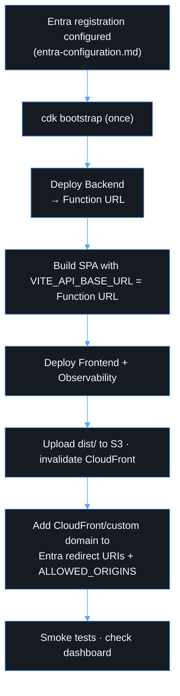

# Deployment



## Local development

```bash
npm install
cp apps/web/.env.example apps/web/.env.local   # fill in tenant/client IDs + API URL
npm run build -w @friendly-funicular/api
npm run dev                                    # http://localhost:5173
```

The SPA needs a reachable API. Deploy the `dev` backend (which allows
`http://localhost:5173` via CORS) and set `VITE_API_BASE_URL` to its Function
URL.

## Manual deploy

The pipeline is the normal path. For a manual deploy:

```bash
export DEPLOY_ENV=dev ENTRA_TENANT_ID=<tenant> ENTRA_CLIENT_ID=<client>
npm ci && npm run build -w @friendly-funicular/api
cd infra
npx cdk deploy FriendlyFunicular-dev-Backend --outputs-file ../cdk-backend.json
cd ..
VITE_ENTRA_TENANT_ID=$ENTRA_TENANT_ID VITE_ENTRA_CLIENT_ID=$ENTRA_CLIENT_ID \
VITE_ENTRA_API_SCOPE=api://$ENTRA_CLIENT_ID/access_as_user \
VITE_API_BASE_URL=<FunctionUrl without trailing slash> \
npm run build -w @friendly-funicular/web
cd infra && npx cdk deploy FriendlyFunicular-dev-Frontend FriendlyFunicular-dev-Observability
aws s3 sync ../apps/web/dist s3://<BucketName> --delete
aws cloudfront create-invalidation --distribution-id <DistributionId> --paths "/*"
```

## First deployment of an environment

There is a chicken-and-egg problem with origins. The CloudFront domain is only
known after the first frontend deploy.

1. Deploy with `ALLOWED_ORIGINS` set to your custom domain or a temporary origin.
2. Take `DistributionDomainName` from the outputs and add
   `https://<domain>` to **both** the Entra SPA redirect URIs and
   `ALLOWED_ORIGINS`.
3. Redeploy the backend.

## Rollback

- **Frontend.** Re-run the deploy workflow on the previous commit. Bucket
  versioning also allows restoring the previous `index.html`.
- **Backend.** Re-run the deploy workflow on the previous commit. The CDK
  deploy is atomic per stack.
