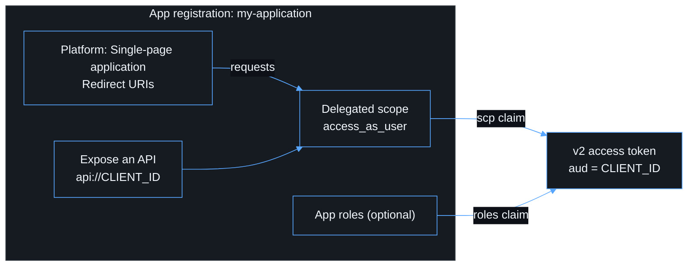

# Entra configuration

There is **one tenant and one app registration** for both the SPA and the API
resource. See [ADR 0001](adr/0001-single-entra-registration.md).



## Steps

1. **Microsoft Entra admin center → App registrations → New registration**
   - Name: `my-application`
   - Supported account types: _Accounts in this organizational directory only_
   - Redirect URI: platform **Single-page application**, `http://localhost:5173`
2. Record the **Directory (tenant) ID** and **Application (client) ID**.
3. **Authentication.** Add the production SPA redirect URIs, for example
   `https://app.example.com`. Optionally add the dedicated callback
   `https://app.example.com/auth/callback`. Register exact URIs only and
   remove stale ones. **Do not create a client secret.**
4. **Expose an API.** Set the Application ID URI to `api://<CLIENT_ID>`, then
   add the scope `access_as_user` (who can consent: admins and users, or
   admins only per policy).
5. **Manifest.** Set `"requestedAccessTokenVersion": 2` (in the newer
   manifest format, `api.requestedAccessTokenVersion`). This makes `iss` equal
   `https://login.microsoftonline.com/<TENANT_ID>/v2.0` and `aud` equal
   `<CLIENT_ID>`.
6. **API permissions.** Add _My APIs → my-application → access_as_user_ and
   grant admin consent if required.
7. **Enterprise application → Properties.** Set _Assignment required_ to
   **Yes** and assign the permitted users or groups.
8. **Conditional Access.** Target the enterprise application with MFA, device
   compliance, sign-in risk and session policies as the organization requires.
9. **Owners.** Assign at least two named owners. Record the business owner and
   technical owner in the registration notes.

## Expected access-token claims

```text
aud = <CLIENT_ID>
iss = https://login.microsoftonline.com/<TENANT_ID>/v2.0
tid = <TENANT_ID>
oid = <USER_OBJECT_ID>
scp = access_as_user
ver = 2.0
```

You can confirm these with the Phase 1 spike. Sign in locally, call `/api/me`,
and check that the returned `oid` and `tenantId` match. Never paste production
tokens into third-party decoders.

## Periodic review

Every quarter, review the redirect URIs, exposed scopes, API permissions,
owners, user assignment and Conditional Access coverage.
