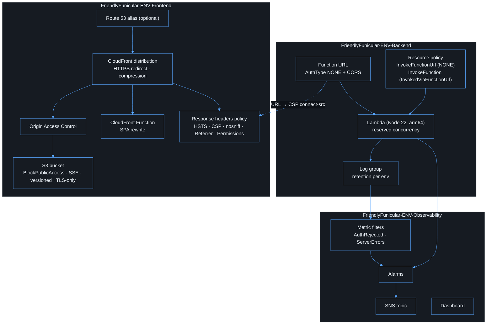

# Infrastructure

The AWS side is built with AWS CDK v2 (TypeScript) in `infra/`. CDK is the
single source of truth; nothing is configured by hand in the console.



## Stacks

| Stack                | Owns                                                                                    |
| -------------------- | --------------------------------------------------------------------------------------- |
| `BackendStack`       | Lambda, log group, Function URL, CORS, resource policy, reserved concurrency            |
| `FrontendStack`      | Private bucket, OAC, distribution, SPA rewrite, security headers, optional ACM/Route 53 |
| `ObservabilityStack` | Metric filters, alarms, SNS topic, dashboard                                            |

## Environments

`infra/lib/config/environments.ts` holds only the values that differ between
environments: region/account, allowed origins, domain, log retention, reserved
concurrency, Lambda sizing and data retention. Deploy-time overrides are read
from CDK context or environment variables:

| Key                                                  | Purpose                                                      |
| ---------------------------------------------------- | ------------------------------------------------------------ |
| `DEPLOY_ENV`                                         | `dev` (default), `test`, `prod`                              |
| `ENTRA_TENANT_ID`, `ENTRA_CLIENT_ID`                 | Required GUIDs, validated at synth time                      |
| `ALLOWED_ORIGINS`                                    | Comma-separated bare origins. `*` and non-HTTPS are rejected |
| `DOMAIN_NAME`, `CERTIFICATE_ARN`, `HOSTED_ZONE_NAME` | Custom domain (the certificate must be in us-east-1)         |
| `ALARM_EMAIL`                                        | SNS email subscription                                       |

> The `test` environment has no default origins. Set `ALLOWED_ORIGINS` (for
> example, the CloudFront domain) or synth will fail on purpose.

## SPA routing

A viewer-request CloudFront Function rewrites extensionless paths to
`/index.html`. That way `/reports` survives a refresh, while a missing
`/assets/x.js` still returns a real 404 and is not masked by the HTML shell.

## Content Security Policy

`connect-src` lists only `'self'`, the Function URL origin and
`login.microsoftonline.com`. `frame-ancestors 'none'` blocks clickjacking.

## Networking

Lambda is deliberately **not** attached to a VPC. It only calls public Entra
endpoints. Attach it to private subnets only when it needs a private resource
such as RDS or a VPC-only service. At that point, design the subnets, security
groups, VPC endpoints and egress explicitly.

## Commands

```bash
npm run build -w @friendly-funicular/api     # bundle the Lambda first
npm run synth                                 # cdk synth (needs ENTRA_* vars)
npm test -w @friendly-funicular/infra         # CDK assertions
```
