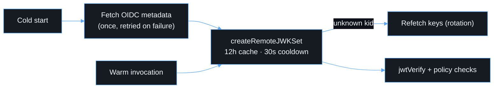

# Lambda

The code is in `apps/api`. It is TypeScript bundled by esbuild to
`dist/index.mjs` (Node.js 22, arm64, ESM).

```text
apps/api/src/
├── index.ts                 # entry; builds config + validator once per execution environment
├── config/config.ts         # env var parsing/validation (non-secret)
├── auth/
│   ├── token-validator.ts   # OIDC discovery + JWKS + policy checks (jose)
│   ├── claims.ts            # RequestIdentity (immutable) from validated claims
│   └── authorization.ts     # scope/role/ownership helpers
├── handlers/
│   ├── application.ts       # router: correlation → auth → dispatch → log
│   ├── health.ts
│   └── me.ts
├── services/profile-service.ts
├── errors/http-errors.ts
└── utils/{http,logger}.ts
```

## Token validation

The low-level cryptography, JWKS fetching, key caching and rotation (a
refetch on an unknown `kid`, with cooldown) belong to
[`jose`](https://github.com/panva/jose). Our code owns only the policy:

| Check     | Rule                                                                                                                          |
| --------- | ----------------------------------------------------------------------------------------------------------------------------- |
| Discovery | `…/<TENANT>/v2.0/.well-known/openid-configuration`. `issuer` must match and `jwks_uri` must be on `login.microsoftonline.com` |
| Algorithm | `RS256` only (HS256 and `none` are rejected)                                                                                  |
| Issuer    | `https://login.microsoftonline.com/<TENANT_ID>/v2.0`                                                                          |
| Audience  | `<CLIENT_ID>`                                                                                                                 |
| Lifetime  | `exp`, `nbf` and `iat` required, 60 s clock tolerance                                                                         |
| Version   | `ver = 2.0`                                                                                                                   |
| Tenant    | `tid = <TENANT_ID>`                                                                                                           |
| Subject   | `oid` and `sub` present                                                                                                       |
| Scope     | `scp` contains `access_as_user` (otherwise 403)                                                                               |



## Environment variables (non-secret)

| Variable          | Example                    |
| ----------------- | -------------------------- |
| `ENTRA_TENANT_ID` | tenant GUID                |
| `ENTRA_CLIENT_ID` | client GUID (the audience) |
| `REQUIRED_SCOPE`  | `access_as_user`           |
| `DEPLOY_ENV`      | `dev` / `test` / `prod`    |
| `SERVICE_NAME`    | `friendly-funicular-api`   |

## Execution-environment reuse

The configuration and the validator (with its JWKS cache) are module-scoped
and reused across invocations. **No user-specific state** is cached globally.

## Adding an endpoint

1. Write a handler in `handlers/` that takes a `RequestIdentity`.
2. Put business rules in `services/`, and call `require*` helpers from `auth/authorization.ts`.
3. Register it in `ROUTES` in `handlers/application.ts` as `protected`.
4. Add tests for success and each denial path.
5. If the handler needs AWS resources, grant narrowly in `infra/lib/backend-stack.ts`.
