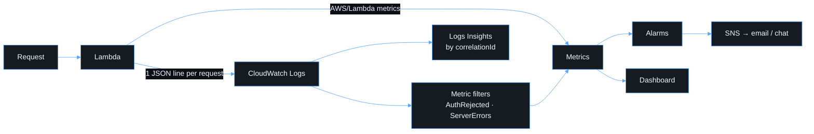

# Observability

Observability should let an operator answer three questions: **Is the service
healthy? What failed? Which request or deployment caused it?**



## Request log

Every invocation writes one structured line:

```json
{
  "timestamp": "2026-09-23T10:00:00.000Z",
  "level": "info",
  "message": "request",
  "service": "friendly-funicular-api",
  "environment": "prod",
  "awsRequestId": "…",
  "correlationId": "…",
  "route": "/api/me",
  "method": "GET",
  "userOid": "…",
  "tenantId": "…",
  "status": 200,
  "duration": 12,
  "result": "success",
  "authOutcome": "accepted"
}
```

Rejected requests add `authFailureReason` (for example `token_expired`,
`wrong_tenant` or `missing_scope`). The logger redacts JWT-shaped strings and
sensitive keys as a second line of defence. Tokens are never passed to it.

## Correlation

The SPA sends `x-correlation-id` with every request. The API accepts it if it
is safe (otherwise it generates one), returns it in the response header and
error body, and logs it. The UI shows it as a "Reference" on errors.

```text
fields @timestamp, status, route, authFailureReason
| filter correlationId = "<reference from the UI>"
```

## Alarms (all notify the SNS topic)

| Alarm                  | Signal                                        |
| ---------------------- | --------------------------------------------- |
| `ErrorsAlarm`          | Lambda `Errors` ≥ 5 for 2 × 5 min             |
| `ThrottlesAlarm`       | Any throttle (reserved concurrency exhausted) |
| `DurationAlarm`        | p95 duration ≥ 80% of timeout for 3 × 5 min   |
| `Url5xxAlarm`          | Function URL 5xx ≥ 5 for 2 × 5 min            |
| `ServerErrorsAlarm`    | Logged 5xx ≥ 5 for 2 × 5 min                  |
| `AuthRejectedAlarm`    | ≥ 100 rejected tokens per 5 min for 2 periods |
| `InvocationSpikeAlarm` | Invocation volume anomaly (cost/abuse)        |

The dashboard `friendly-funicular-<env>` shows requests, duration, errors,
throttles and authentication failures.
