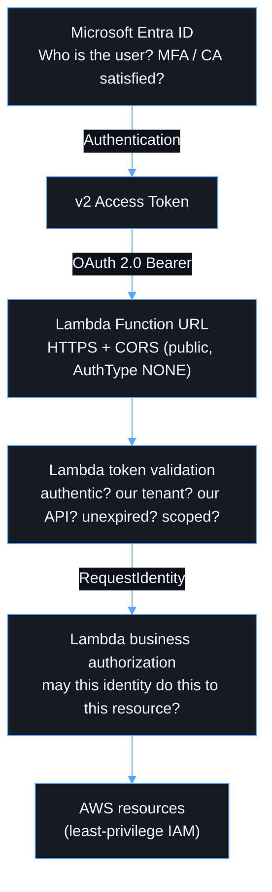

# Security

## Trust boundaries

Each layer has one primary responsibility. A frontend route cannot grant
backend access. A signed Entra token is rejected if it is not for this API. A
valid token does not grant access to every record.

## Controls

| Area              | Control                                                                                                                     |
| ----------------- | --------------------------------------------------------------------------------------------------------------------------- |
| Identity          | Single-tenant Entra, Authorization Code + PKCE, MFA/Conditional Access in Entra, user assignment required                   |
| Browser           | Public client with no secret. Build fails on secret-like `VITE_*` names. ESLint forbids `clientSecret`. CI greps the bundle |
| Token storage     | MSAL `sessionStorage`. Tokens are never logged or sent anywhere except the API                                              |
| Open redirect     | OAuth `state` return path is sanitized to a same-origin relative path                                                       |
| API admission     | jose-based JWT validation (RS256 only, iss/aud/tid/ver/exp/nbf/oid/scp)                                                     |
| Authorization     | Stable claims only (`oid`, `sub`, `tid`, `scp`, `roles`). Cross-tenant access is always denied                              |
| Public endpoint   | Resource policy limited to Function URL invocation, reserved concurrency, throttle and invocation-spike alarms              |
| CORS              | Explicit origins only. `*` is rejected at synth time                                                                        |
| Frontend delivery | Private S3 (Block Public Access, SSE, TLS-only policy), CloudFront OAC, HTTPS redirect, HSTS/CSP/etc.                       |
| IAM               | Lambda role can only write its own logs. CDK tests fail on wildcard actions or resources                                    |
| Logging           | Structured JSON with defence-in-depth redaction of token-like values and sensitive keys                                     |
| Supply chain      | Lockfile, `npm audit` in CI, Dependabot (`.github/dependabot.yml`), patches go through the pipeline                         |
| CI/CD             | GitHub OIDC to AWS with no stored keys. Environment approvals for test and prod                                             |

## Accepted risks

- **Public Function URL.** Anyone can invoke it. Invalid requests still run
  Lambda (and cost money) before they are rejected. Mitigations: fast
  rejection with no downstream calls, reserved concurrency, alarms, and
  organizational edge controls. If abuse becomes material, add a front door
  such as CloudFront with WAF and record it in an ADR.
- **Single app registration.** See [ADR 0001](adr/0001-single-entra-registration.md).
- **`sessionStorage` token cache.** Any XSS on the origin could read tokens.
  Mitigations: strict CSP with no inline script, React escaping, and no
  `dangerouslySetInnerHTML`.

## Never

- Put a client secret, AWS key, private key or password in a `VITE_*` variable.
- Log `Authorization` headers, access tokens or ID tokens.
- Authorize by email, UPN or display name.
- Use `Access-Control-Allow-Origin: *` for the API.
- Grant `Action: "*"` / `Resource: "*"` without a documented justification.
