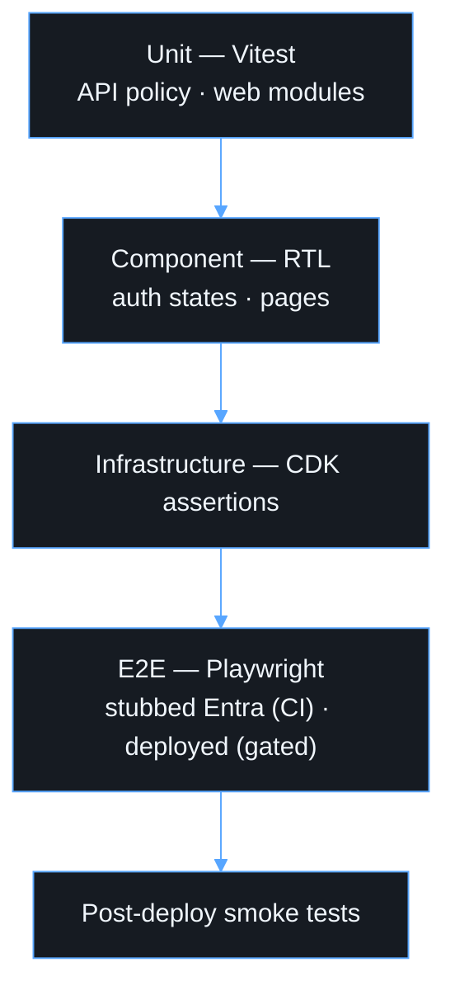

# Testing

| Layer          | Location                     | Command                                 |
| -------------- | ---------------------------- | --------------------------------------- |
| API unit       | `apps/api/test`              | `npm test -w @friendly-funicular/api`   |
| Web unit/RTL   | `apps/web/src/**/*.test.tsx` | `npm test -w @friendly-funicular/web`   |
| CDK assertions | `infra/test`                 | `npm test -w @friendly-funicular/infra` |
| E2E            | `apps/web/e2e`               | `npm run test:e2e`                      |
| Everything     |                              | `npm run validate`                      |

## API security tests

The tests sign real RS256 JWTs with a throwaway key (`test/helpers.ts`) and
verify them through the production validator with a local JWKS. They cover
valid tokens, missing/malformed/expired/not-yet-valid tokens, wrong
issuer/audience/tenant, v1 tokens, missing `oid`, missing scope (403),
app-only tokens, unknown key, wrong key, HS256 downgrade, tampered payload,
OIDC discovery issuer mismatch and a rogue `jwks_uri`. Handler tests cover
401/403/404/405/500, correlation IDs, and that tokens never appear in logs.
Cryptographic primitives are not re-tested because they belong to `jose`.

## Frontend tests

MSAL is replaced by a fake `IPublicClientApplication` or a fake `AuthContext`.
The tests cover: login page rendering with no credential fields, keyboard
operation, loading/redirect/error/retry states, redirect completion,
return-path sanitizing, session restore, silent token acquisition,
interaction-required fallback, API `Authorization` header, 401/403/429/5xx,
network and timeout mapping, retry policy, and logout.

## E2E

- **Local/CI** (`e2e/login.spec.ts`): runs the real SPA in Chromium with
  `login.microsoftonline.com` stubbed. It asserts that the authorize redirect
  uses `response_type=code`, `code_challenge_method=S256`, the API scope, and
  no client secret.
- **Deployed** (`e2e/deployed.spec.ts`): set `E2E_BASE_URL`,
  `E2E_STORAGE_STATE` (a captured session for a controlled test identity) and
  `E2E_API_BASE_URL`. MFA and Conditional Access are never weakened for
  automation. Capture the storage state manually with `npx playwright codegen
--save-storage=state.json <url>`.

If Playwright's bundled browser is unavailable, set
`PLAYWRIGHT_CHROMIUM_EXECUTABLE` to a local Chromium.
