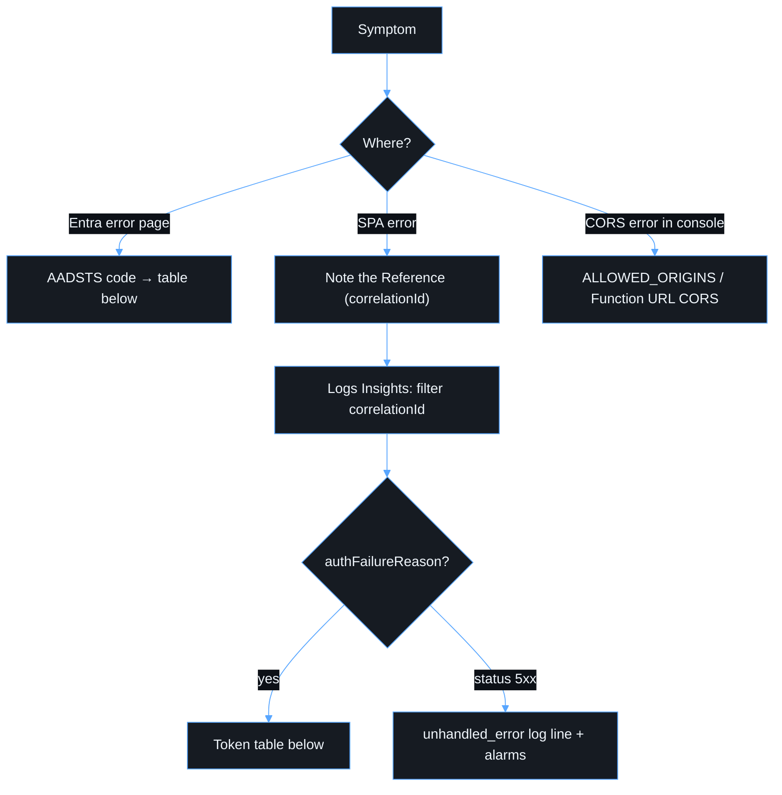

# Troubleshooting

## Entra errors

| Code / symptom  | Likely cause                            | Fix                                                    |
| --------------- | --------------------------------------- | ------------------------------------------------------ |
| `AADSTS50011`   | Redirect URI not registered             | Add the exact origin as an **SPA** redirect URI        |
| `AADSTS9002326` | URI registered under the _Web_ platform | Move it to _Single-page application_                   |
| `AADSTS65001`   | Consent missing for `access_as_user`    | Grant consent or admin consent                         |
| `AADSTS50105`   | User not assigned to the app            | Assign the user or group in the Enterprise application |
| `AADSTS53003`   | Blocked by Conditional Access           | Expected. Review the CA policy with the identity team  |

## API `authFailureReason`

| Reason                      | Meaning / fix                                                                               |
| --------------------------- | ------------------------------------------------------------------------------------------- |
| `missing_token`             | SPA didn't attach a token. Check the session and `useApi()` usage                           |
| `invalid_claim_iss`         | v1 token (`sts.windows.net`). Set `requestedAccessTokenVersion: 2`                          |
| `invalid_claim_aud`         | Token for another resource (for example Graph). Check `VITE_ENTRA_API_SCOPE`                |
| `wrong_tenant`              | Token from another tenant                                                                   |
| `unsupported_token_version` | `ver` is not `2.0`. Same fix as `invalid_claim_iss`                                         |
| `token_expired`             | Clock skew or a stale token. MSAL normally refreshes silently                               |
| `missing_scope` (403)       | Token lacks `access_as_user`. Check scope exposure and consent                              |
| `unknown_signing_key`       | Key rotation. jose refetches automatically. Persistent failures mean a wrong tenant or JWKS |
| `invalid_signature`         | Forged or corrupted token                                                                   |

A spike in `AuthRejectedAlarm` after a deploy usually means misconfiguration
(wrong `ENTRA_CLIENT_ID` or tenant). Without a deploy it may mean probing, so
check source IPs in the Function URL access patterns.

## CORS failures

The browser console shows _blocked by CORS policy_. Either the SPA origin is
not in `ALLOWED_ORIGINS` for that environment, or it has a trailing slash or
path. Origins must be bare (`https://host[:port]`). Redeploy the backend after
changing it.

## Redirect loops or a blank page after login

- Check that `VITE_ENTRA_CLIENT_ID`/`TENANT_ID` match the registration.
- `sessionStorage` is blocked (some privacy modes): sign-in cannot persist.
- A CSP violation in the console means `connect-src` does not include the API
  origin. Redeploy the frontend after the backend URL changes.

## Deep link returns 404/403 from CloudFront

The SPA rewrite function should map extensionless paths to `/index.html`. A
path with a dot (for example `/v1.2/report`) is treated as a file. Rename the
route or extend the function.
