# AWS Well-Architected review

The workload is reviewed against the six pillars before production and again
after any material architecture change. Findings are tracked as engineering
work with owners and dates.

```mermaid
%%{init: {
  "theme": "base",
  "securityLevel": "strict",
  "themeVariables": {
    "background": "#0d1117",
    "primaryColor": "#161b22",
    "primaryTextColor": "#f0f6fc",
    "primaryBorderColor": "#58a6ff",
    "secondaryColor": "#21262d",
    "secondaryTextColor": "#f0f6fc",
    "secondaryBorderColor": "#3fb950",
    "tertiaryColor": "#1c2128",
    "tertiaryTextColor": "#f0f6fc",
    "tertiaryBorderColor": "#d29922",
    "lineColor": "#58a6ff",
    "textColor": "#f0f6fc",
    "clusterBkg": "#161b22",
    "clusterBorder": "#30363d",
    "edgeLabelBackground": "#0d1117",
    "actorBkg": "#161b22",
    "actorBorder": "#58a6ff",
    "actorTextColor": "#f0f6fc",
    "signalColor": "#58a6ff",
    "signalTextColor": "#f0f6fc"
  }
}}%%

flowchart TD
    App["Entra + AWS<br/>Application"]
    OE["Operational Excellence"]
    SEC["Security"]
    REL["Reliability"]
    PERF["Performance Efficiency"]
    COST["Cost Optimization"]
    SUS["Sustainability"]

    App --> OE & SEC & REL & PERF & COST & SUS
    OE --> CDK["CDK + CI/CD"]
    OE --> Logs["Structured logs + runbooks"]
    SEC --> Entra["Entra MFA + CA"]
    SEC --> JWT["Lambda JWT validation"]
    SEC --> IAM["Least-privilege IAM"]
    REL --> Managed["Managed services"]
    REL --> Alarm["Alarms + smoke tests"]
    PERF --> CF["CloudFront caching"]
    PERF --> Lambda["arm64 · env reuse · JWKS cache"]
    COST --> Serverless["Scale to zero"]
    COST --> Retention["Log retention"]
    SUS --> Scale["Scale on demand"]
    SUS --> Cache["Efficient caching"]
```

| Pillar                 | Implementation                                                                                                                     | Evidence                                 |
| ---------------------- | ---------------------------------------------------------------------------------------------------------------------------------- | ---------------------------------------- |
| Operational Excellence | CDK IaC, CI quality gates, OIDC deploys, structured logs, correlation IDs, dashboard, runbooks                                     | `infra/`, `.github/`, `docs/`            |
| Security               | Entra MFA/CA, PKCE, no SPA secrets, strict JWT validation, stable-claim authorization, least-privilege IAM, private S3, CSP/HSTS   | `security.md`, CDK assertions, API tests |
| Reliability            | Managed Entra/Lambda/CloudFront/S3, JWKS caching with rotation, conservative client retries, alarms, smoke tests, versioned bucket | `observability.md`, `ci-cd.md`           |
| Performance Efficiency | CloudFront caching and compression, immutable hashed assets, arm64 Lambda, execution-environment reuse                             | `infrastructure.md`, `lambda.md`         |
| Cost Optimization      | Pay-per-use Lambda, S3 static hosting, reserved concurrency cap, log retention, `PRICE_CLASS_100`, noncurrent-version expiry       | `environments.ts`                        |
| Sustainability         | Serverless and scale to zero, arm64, caching, no idle infrastructure                                                               |                                          |

## Recorded trade-offs

1. **Single Entra app registration.** The SPA and API are one registration by
   stated project constraint. This means tighter coupling and a larger blast
   radius than Microsoft's recommended separation. Guardrails and mandatory
   revisit triggers are in
   [ADR 0001](adr/0001-single-entra-registration.md).
2. **Direct Lambda Function URL.** This is simpler and cheaper than API
   Gateway, but token validation, abuse protection and some observability move
   into Lambda, and invalid requests still invoke the function. Mitigations
   are reserved concurrency, fast rejection and alarms. Revisit this if a WAF,
   a custom API domain or usage plans are needed.

## Open items before production

- [ ] Named owners for the Entra registration and AWS account are recorded.
- [ ] Conditional Access policy targeting the app is reviewed by the identity team.
- [ ] Alarm email/chat subscription is confirmed.
- [ ] Custom domain and ACM certificate are provisioned for prod.
- [ ] Deployed E2E storage state is set up for a controlled test identity.
