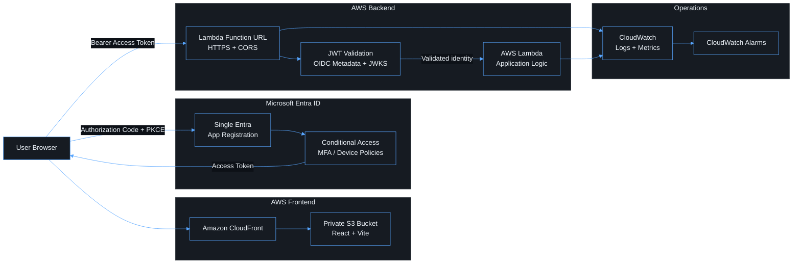
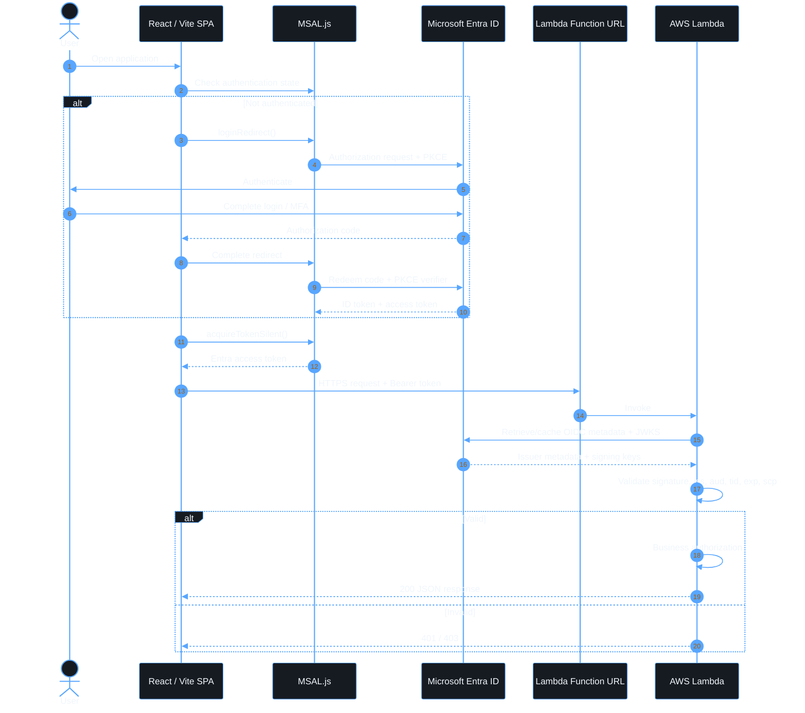
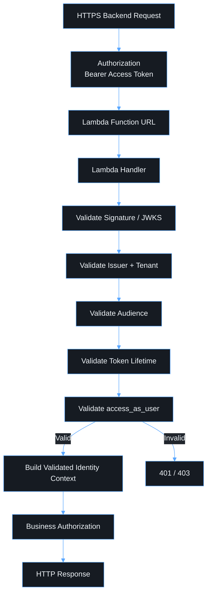
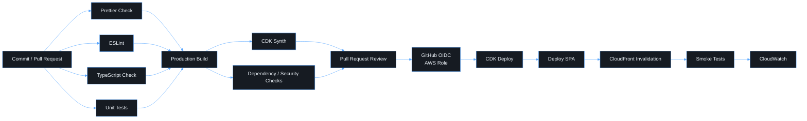

# Microsoft Entra ID + React Vite + AWS Lambda Architecture Plan (Direct Lambda Function URL)

> **Status: original target plan, superseded in part.** This document
> describes the plan as originally written, including a TypeScript Lambda
> and CloudFront in front of S3. The actual implementation deviates from it
> in three recorded, deliberate ways — see
> [`adr/0002-dotnet-lambda-runtime.md`](adr/0002-dotnet-lambda-runtime.md)
> (C# Lambda, not TypeScript),
> [`adr/0003-remove-cloudfront.md`](adr/0003-remove-cloudfront.md) (API
> Gateway + Lambda instead of CloudFront), and
> [`adr/0004-project-rename.md`](adr/0004-project-rename.md) (package name).
> For the as-built system, start at [`architecture.md`](architecture.md)
> instead; this file remains the record of the original design intent and
> rationale.

## Executive Summary

This document defines the target architecture and delivery plan for a secure single-page application that uses Microsoft Entra ID as the identity provider and AWS serverless services for hosting, compute, monitoring, and deployment. The application is intentionally designed without Amazon Cognito or AWS Amplify. Identity remains owned by Microsoft Entra ID, while AWS is responsible for application delivery and execution.

The browser application is built with React, Vite, and TypeScript. Authentication is implemented with MSAL using the OAuth 2.0 Authorization Code Flow with PKCE. The resulting Entra access token is sent directly to an AWS Lambda Function URL. Because Lambda Function URLs do not provide native Microsoft Entra JWT validation, the function validates the bearer access token against the tenant-specific OpenID Connect metadata and JWKS before executing protected application logic. Lambda is therefore responsible for token validation, business authorization, input validation, domain logic, and integration with downstream AWS or enterprise services.

The design deliberately uses one Microsoft Entra tenant and one tightly coupled Entra app registration for the SPA and its API resource. This reduces registration overhead but increases coupling and blast radius. Microsoft recommends separating user-facing applications and APIs in many architectures, so this document treats the single-registration model as a conscious constraint that must be revisited if the API becomes independently consumed, gains elevated permissions, serves multiple clients, or evolves into a broader platform.

The plan is structured around the AWS Well-Architected Framework. Every major component therefore has an operational purpose, security boundary, reliability expectation, performance consideration, cost implication, and testable definition of done.

## Architecture Principles

The implementation should follow a small set of non-negotiable principles:

1. **Identity stays with Entra.** The application does not implement its own credential store, password handling, or custom sign-in protocol.
2. **The SPA is a public client.** It must never contain a client secret, private key, AWS credential, or other confidential credential.
3. **Use access tokens for APIs.** ID tokens are for the client application to understand the authenticated session; access tokens are presented to Lambda Function URL.
4. **Validate before business logic.** Lambda validates the Entra access token immediately on entry and rejects invalid requests before protected application logic executes.
5. **Authorize again at the business layer.** A valid token does not automatically mean a user may perform every business operation.
6. **Infrastructure is reproducible.** AWS resources, including the Lambda Function URL and its resource policy, are created through CDK and validated through automated tests and CI/CD.
7. **Security controls are observable.** Authentication failures, Function URL request failures, Lambda errors, throttling, and deployment health must be measurable without logging sensitive tokens.
8. **Documentation is part of the product.** Architecture diagrams, operational runbooks, deployment instructions, security assumptions, and troubleshooting guidance are versioned with the code.

## Scope and Assumptions

This plan assumes a workforce-oriented, single-tenant Microsoft Entra environment and an AWS-hosted application accessed through a web browser. The initial API is user-delegated, meaning API requests represent a signed-in person rather than an unattended daemon or machine identity.

The first implementation should remain intentionally simple. Additional services such as DynamoDB, RDS, SQS, EventBridge, Step Functions, Secrets Manager, or private VPC integrations should be added only when there is a defined application requirement. The architecture should not accumulate AWS services merely because they are available.

## 1. Objective

### Description

The objective is to establish a secure and maintainable reference implementation that can move from local development to production without replacing its authentication model or infrastructure foundations. The application should provide a professional sign-in experience, a protected API, production-grade observability, automated quality controls, and reproducible infrastructure.

This section also defines the technology boundary. The listed tools are not simply a package inventory: React and Vite own the browser experience, MSAL owns browser-side Entra protocol integration, Lambda Function URL owns edge authorization, Lambda owns application execution, CDK owns AWS provisioning, and the testing and linting toolchain enforces engineering quality before deployment.

The explicit exclusions are security decisions. Cognito and Amplify are excluded because Entra is the required identity provider and the architecture should avoid an unnecessary identity-broker layer. Client secrets are excluded from the browser because a SPA cannot keep them confidential. Custom password handling and unnecessary JWT cryptography in Lambda are excluded because they would increase attack surface and maintenance responsibility.

Build a secure web application using:

- React 19
- Vite
- TypeScript
- Microsoft Entra ID
- One Entra tenant
- One Entra app registration
- MSAL.js
- OAuth 2.0 Authorization Code Flow with PKCE
- AWS Lambda Function URL
- Lambda-side Microsoft Entra JWT validation
- AWS Lambda
- AWS CDK v2 with TypeScript
- Amazon S3
- Amazon CloudFront
- CloudWatch
- GitHub Actions or equivalent CI/CD
- ESLint
- Prettier
- Vitest
- React Testing Library
- Playwright
- Husky + lint-staged

Explicitly excluded:

- Amazon Cognito
- AWS Amplify
- Client secrets in the browser
- Custom password authentication
- Ad hoc or incomplete JWT validation. Lambda must use standards-based OpenID Connect metadata/JWKS validation because there is no Lambda Function URL authorizer in this design.

Microsoft recommends authorization code flow with PKCE for browser-based SPAs.

---

# 2. Target Architecture

## Description

The target architecture separates frontend delivery, identity, HTTPS invocation, and application execution. CloudFront and S3 deliver static application assets. Microsoft Entra ID performs user authentication and organizational access policy. A Lambda Function URL exposes the HTTPS backend endpoint. Lambda validates Entra access tokens at the start of each protected request and only then executes application logic.

This separation keeps authentication with Microsoft Entra while moving API token validation into the Lambda boundary. The function does not handle passwords or MFA, but it must discover and cache Entra signing keys, validate token signature and claims, and create a trusted authorization context before business code executes.

Operationally, the request path has two distinct planes. The **frontend plane** serves versioned static files through CloudFront. The **backend plane** handles dynamic requests through a Lambda Function URL and Lambda. These planes can be deployed, monitored, and rolled back independently.



The critical trust boundary is:

**Entra issues the token → browser sends it to the Lambda Function URL → Lambda validates the token → business logic trusts only the locally validated claims.**

Lambda validates the signing key, issuer, audience, token timestamps, tenant, and required `scope`/`scp` claim immediately after receiving the request and before protected business logic runs.

---

# 3. Single Entra App Registration

## Description

The identity model uses one Microsoft Entra tenant and one Entra application registration for both the SPA configuration and the API resource definition. The app registration therefore contains SPA redirect URIs and also exposes the delegated API scope that the browser requests when calling the AWS-hosted API.

This is a tightly coupled model. It is acceptable only while the browser and API are treated as one product with the same ownership, lifecycle, security classification, and authorization boundary. The architecture must document this explicitly because using one registration reduces isolation compared with separate client and resource registrations.

### Revisit the single-registration decision when

Split the SPA and API into separate Entra app registrations if any of the following becomes true:

- the API is consumed by another application;
- mobile, desktop, daemon, or partner clients are introduced;
- the API gains elevated Microsoft Graph or enterprise permissions;
- client-specific scopes, consent, or access policies are required;
- the API is managed by a different team or lifecycle;
- separate compromise boundaries are required by security architecture or audit.

The requirement is deliberately:

**1 tenant + 1 application registration**

The same application registration represents:

1. The React SPA client.
2. The protected API resource.

Microsoft normally recommends separating applications that authenticate users from APIs that expose protected resources because separation improves isolation and least privilege. This project intentionally accepts the tighter coupling to meet the single-registration requirement.

## Entra configuration

### Description

The Entra registration is the authoritative identity configuration for the application. It defines who may sign in, which browser locations Entra may redirect back to, which delegated API permission is exposed, and how the resulting tokens identify the intended resource.

The registration should be single-tenant unless there is an explicit business requirement for external tenants. Restricting the sign-in audience simplifies issuer validation and prevents accidental acceptance of identities from unrelated organizations.

Ownership is also an operational control. Assign a small number of named application owners, document the business owner and technical owner, and periodically review redirect URIs, scopes, permissions, and unused configuration so the registration does not become an orphaned security dependency.

Create:

```text
Application name:
my-application

Supported account type:
Accounts in this organizational directory only

Application type:
Single-page application
```

Record:

```text
TENANT_ID
CLIENT_ID
```

No client secret is required or permitted for the SPA.

### Development redirect URI

The development redirect URI exists only for local developer authentication. It allows the Entra authorization response to return to the local Vite development server. Keep it explicit and predictable so developers do not add broad or temporary redirect locations that are forgotten later.

Localhost HTTP is acceptable for local development, but production redirect URIs must use HTTPS.

```text
http://localhost:5173
```

### Production redirect URI

The production redirect URI is part of the application's trust boundary because Entra will return authorization results only to registered locations. Production entries should use the final HTTPS application domain and should be reviewed whenever domains, callback routes, or environments change.

Avoid wildcard-style thinking. Register only the exact URIs the application needs. Stale redirect URIs should be removed during normal security hygiene.

```text
https://app.example.com
```

Optional dedicated callback:

```text
https://app.example.com/auth/callback
```

## Expose the API

### Description

Exposing the API creates the logical OAuth resource that the SPA requests permission to use. The Application ID URI identifies the resource and the delegated `access_as_user` scope represents permission for the signed-in user to call the API through the browser application.

The scope is more than a label. Lambda must require it on protected operations so that a structurally valid token without the intended API permission is still rejected. This also helps distinguish access tokens intended for this API from unrelated tokens issued by the same tenant.

If the application later requires different privilege levels, prefer well-defined scopes and/or user app roles rather than hard-coded email addresses or UI-only authorization checks.

Application ID URI:

```text
api://<CLIENT_ID>
```

Delegated scope:

```text
access_as_user
```

Full scope requested by MSAL:

```text
api://<CLIENT_ID>/access_as_user
```

Microsoft documents `api://{clientId}` as the normal Application ID URI pattern for custom protected APIs.

Ensure the API produces **v2 access tokens**.

For v2 Microsoft Entra access tokens, the `aud` claim is the API application's client ID. Because this architecture deliberately uses a single registration, that is the same `CLIENT_ID` used by the React SPA.

Expected claims include:

```text
aud = <CLIENT_ID>
iss = https://login.microsoftonline.com/<TENANT_ID>/v2.0
tid = <TENANT_ID>
oid = <USER_OBJECT_ID>
scp = access_as_user
```

---

# 4. Entra Security Controls

## Description

Microsoft Entra ID is the policy enforcement point for user authentication. MFA, Conditional Access, sign-in risk, device requirements, session controls, and user assignment should remain centralized there instead of being recreated inside React or Lambda.

The application consumes the outcome of those controls through tokens. This means security teams can strengthen authentication policy without redeploying the application. It also keeps authentication events in the enterprise identity platform, where they can be correlated with other identity activity.

Application authorization should use stable identifiers. Claims such as `oid`, `sub`, `tid`, `scp`, and supported role claims are suitable inputs to access decisions. Display names, email addresses, and user principal names can change and therefore should be treated as presentation data rather than durable authorization keys.

For higher-risk operations, business authorization should be explicit. For example, a user may be authenticated and possess the API scope but still be denied access to a record they do not own or a function reserved for an administrative role.

Authentication policy remains owned by Entra.

Enable appropriate organizational controls such as:

```text
MFA
Conditional Access
Sign-in risk policies
Device compliance where required
Session controls
Named locations where appropriate
Group/user assignment
```

Do not recreate these controls inside React or Lambda.

For authorization decisions, prefer stable claims such as:

```text
oid
sub
roles
scp
tid
```

Do not authorize a user based on:

```text
email
preferred_username
UPN
display name
```

Microsoft specifically warns that mutable identity claims such as `email` and `preferred_username` should not be used as authorization identifiers and recommends stable identifiers such as `oid` or `sub`.

---

# 5. Authentication Flow

## Description

The authentication flow uses OAuth 2.0 Authorization Code Flow with PKCE because the React application is a public browser client. PKCE protects the authorization-code exchange without relying on a client secret that could not be safely stored in JavaScript.

MSAL should own browser-side protocol details such as constructing authorization requests, managing PKCE, handling redirects, maintaining account state, and obtaining tokens. Application code should call MSAL APIs rather than manually assembling OAuth requests.

After sign-in, the SPA acquires an access token for the application API scope and sends it as a bearer token to the Lambda Function URL. The browser should not send the ID token as an authorization credential. Lambda validates the access token against the tenant-specific issuer, audience, signature keys, lifetime, tenant, and required scope before creating an application identity context.

A normal page refresh should not force the user through a visible login flow every time. The application should first restore MSAL account state and attempt silent token acquisition. Interactive redirect should occur only when no valid session is available or Entra requires user interaction.



---

# 6. React + Vite Authentication Layer

## Description

The frontend should keep identity concerns isolated from presentation and business UI. Authentication configuration, session state, protected routing, token acquisition, and API access should therefore live in dedicated modules rather than being duplicated across pages and components.

`auth-config.ts` owns static Entra configuration. `auth-provider.tsx` integrates MSAL with the React component tree. `protected-route.tsx` controls user experience for pages that require a session. `token-service.ts` obtains access tokens without exposing MSAL internals throughout the codebase. The API layer then consumes that token service when making authenticated requests.

This modularity improves testing and reduces accidental security drift. A future change in token acquisition or error handling can be made once in the authentication layer instead of in every feature component.

The UI should treat authentication as asynchronous state with explicit states such as initializing, unauthenticated, redirecting, authenticated, expired/interaction-required, and failed. Avoid brief flashes of protected content while session state is still being determined.

Install:

```bash
npm install @azure/msal-browser @azure/msal-react
```

The frontend authentication modules should be separated into:

```text
src/
├── auth/
│   ├── auth-config.ts
│   ├── auth-provider.tsx
│   ├── protected-route.tsx
│   ├── use-auth.ts
│   └── token-service.ts
│
├── api/
│   ├── api-client.ts
│   └── api-types.ts
│
├── components/
│   ├── auth/
│   │   ├── login-button.tsx
│   │   ├── logout-button.tsx
│   │   └── user-menu.tsx
│   └── layout/
│
├── pages/
│   ├── login-page.tsx
│   ├── auth-callback-page.tsx
│   ├── home-page.tsx
│   ├── forbidden-page.tsx
│   └── error-page.tsx
│
├── routes/
│   └── app-router.tsx
│
├── config/
│   └── environment.ts
│
├── main.tsx
└── app.tsx
```

---

# 7. Frontend Environment Configuration

## Description

Frontend environment configuration contains public runtime/build configuration required by the SPA. Tenant IDs, application client IDs, API scopes, and public API base URLs are identifiers, not secrets, so they may be made available to browser code when required.

The important boundary is that every `VITE_` variable becomes part of the browser-delivered application. Build pipelines and code review should therefore reject attempts to place passwords, private keys, AWS access keys, Entra client secrets, database credentials, or other confidential material in Vite environment files.

Use environment-specific configuration for development, test, and production. The build or deployment process should fail clearly when required values are missing rather than silently using unsafe defaults.

Use:

```env
VITE_ENTRA_TENANT_ID=
VITE_ENTRA_CLIENT_ID=
VITE_ENTRA_API_SCOPE=api://CLIENT_ID/access_as_user
VITE_API_BASE_URL=
```

These identifiers are configuration values, not passwords.

Never place the following in a Vite environment variable:

```text
Client secrets
AWS access keys
Private keys
Certificates
Database passwords
API secrets
```

Anything prefixed with `VITE_` is available to browser JavaScript.

---

# 8. MSAL Configuration

## Description

MSAL is the browser-side security library that integrates the SPA with the Microsoft identity platform. Configuration should be intentionally small: a tenant-specific authority, the application client ID, registered redirect URI, cache choice, and the API scope needed by the application.

Use tenant-specific authority rather than broad multi-tenant endpoints for this single-tenant workload. This reduces ambiguity and aligns Lambda issuer validation with the same tenant boundary.

`acquireTokenSilent()` should be the normal token path after the user has an established session. Interactive redirect is a recovery path when consent, MFA, Conditional Access, reauthentication, or another user interaction is required.

Token cache strategy should be selected deliberately. `sessionStorage` limits persistence to a browser tab/session and is a reasonable security-oriented default. If product requirements later demand different persistence, record the security trade-off before changing it.

Conceptually:

```text
authority:
https://login.microsoftonline.com/<TENANT_ID>

clientId:
<CLIENT_ID>

redirectUri:
window.location.origin

scope:
api://<CLIENT_ID>/access_as_user
```

Token cache:

```text
sessionStorage
```

Preferred login mechanism:

```text
loginRedirect()
```

Preferred token mechanism:

```text
acquireTokenSilent()
```

Fallback only when interaction is required:

```text
acquireTokenRedirect()
```

The browser never receives an Entra client secret.

---

# 9. Login Page

## Description

The login page is an application entry point, not a credential collection form. Its purpose is to present application identity, explain that corporate Microsoft authentication will be used, and start the MSAL redirect flow. The actual username, password, MFA, and Conditional Access interactions occur on Microsoft-hosted identity pages.

The page should look deliberate even though it is functionally small. Use the same design system as the authenticated application, provide a visible sign-in action, show progress during redirects, and display actionable error messages when authentication cannot begin or complete.

Accessibility is part of the definition of done. The primary action must work from the keyboard, focus states must be visible, contrast must meet accessibility expectations, loading status should be understandable to assistive technology, and animation should respect reduced-motion preferences.

Do not add custom username or password fields simply to make the screen feel more substantial. Doing so creates confusion about where credentials are processed and can train users to enter enterprise credentials into an application-controlled form.

The login page should be intentionally simple because Entra performs credential collection.

Recommended layout:

```text
┌────────────────────────────────────────────┐
│                                            │
│              Company Logo                  │
│                                            │
│            Secure Application              │
│                                            │
│   Sign in using your corporate account     │
│                                            │
│      ┌──────────────────────────────┐      │
│      │   Sign in with Microsoft     │      │
│      └──────────────────────────────┘      │
│                                            │
│    Protected by Microsoft Entra ID         │
│                                            │
└────────────────────────────────────────────┘
```

Visual direction:

```text
Background:     #0d1117
Surface:        #161b22
Surface raised: #21262d
Border:         #30363d
Primary text:   #f0f6fc
Secondary text: #8b949e
Accent:         #58a6ff
Success:        #3fb950
Warning:        #d29922
Error:          #f85149
```

The page should contain:

- application branding
- Microsoft sign-in action
- authentication loading state
- redirect progress state
- friendly authentication error handling
- retry action
- accessibility support
- keyboard navigation
- responsive layout

Do not build username/password fields.

---

# 10. Protected React Routing

## Description

Protected routing is a presentation and navigation control. It prevents an unauthenticated user from entering application routes that require an active session and provides predictable redirects to the login page or an access-denied experience.

It is not a backend security boundary. Any attacker can bypass or modify browser-side JavaScript, so every sensitive backend action must still be protected by Lambda token validation and business authorization.

A protected route should wait until authentication initialization is complete before deciding whether to render or redirect. This prevents redirect loops and protected-content flashes during application startup.

Routing model:

```text
/
        ↓
AuthProvider
        ↓
MSAL authentication state
        ↓
+-------------------------+
|                         |
Authenticated          Unauthenticated
|                         |
ProtectedRoute          /login
|
Application
```

The application must not rely on frontend routing as an authorization control.

`ProtectedRoute` improves UX only.

Real authorization occurs at:

```text
Entra
    ↓
Lambda JWT validation
    ↓
Lambda business authorization
```

---

# 11. API Client

## Description

The API client is the single browser-side gateway to backend services. It should hide token acquisition, common headers, correlation IDs, JSON serialization, error normalization, timeout behavior, and retry policy from feature components.

Before each protected request, the client obtains an access token for the intended API scope through the token service and attaches it in the standard `Authorization: Bearer` header when calling the Lambda Function URL. The token must never be written to application logs, analytics events, error trackers, or browser-visible debug output in production.

HTTP status codes should be translated consistently. A 401 generally means the authentication credential is absent, invalid, expired, or otherwise unusable. A 403 means the caller is authenticated but not permitted. A 429 indicates throttling and may justify controlled backoff. 5xx responses represent server-side failures and should surface a correlation ID that support teams can trace without exposing internal details.

Retries should be conservative. Never blindly retry non-idempotent operations, and do not create retry storms when the API is already throttling or failing.

The shared API client must perform:

```text
Request
   ↓
acquireTokenSilent()
   ↓
Access Token
   ↓
Authorization: Bearer <token>
   ↓
Lambda Function URL
```

Centralize this behavior in:

```text
src/api/api-client.ts
```

Do not scatter token handling across React components.

Handle:

```text
401 -> authentication/session problem
403 -> authenticated but unauthorized
429 -> throttled
5xx -> backend/server failure
network error -> connectivity failure
```

Never log the bearer token.

---

# 12. AWS API Architecture

## Description

The AWS Lambda Function URL is the public HTTPS entry point. It provides a managed HTTPS endpoint and CORS configuration, then invokes the function for incoming requests. Because Function URLs do not provide native Microsoft Entra JWT authorization, the function must perform standards-based JWT validation before protected application logic.

Use a maintained JWT/OIDC validation library rather than hand-written cryptography. The validation layer should discover the tenant-specific OpenID Connect metadata, cache JWKS signing keys, validate the JWT signature, verify issuer and audience, check time-based claims, validate tenant identity, and require the intended delegated scope.

Protected operations must require the API's delegated scope. A token being signed by Entra does not by itself prove that the token was intended to call this backend.

Keep unauthenticated behavior deliberate. Because `AuthType: NONE` makes the Function URL publicly invokable, every protected path must enforce bearer-token validation in code. A health response may be unauthenticated if required for availability checks, but it must not expose configuration, dependency details, environment variables, or sensitive system state.

**Security trade-off:** public invocation is an intentional trade-off of using a direct Lambda Function URL. The Function URL resource policy should permit invocation only through the Function URL, the Lambda authentication middleware must run before protected logic, and CloudWatch alarms, reserved concurrency, and organizational edge controls should be considered for abuse and cost protection.

Use:

```text
AWS Lambda Function URL
AuthType: NONE
```

for direct browser-to-Lambda HTTPS invocation. Authentication is implemented inside Lambda because Function URLs do not natively understand Microsoft Entra access tokens.

Configure Lambda-side JWT validation with:

```text
Issuer:
https://login.microsoftonline.com/<TENANT_ID>/v2.0

Audience:
<CLIENT_ID>

Token source:
Authorization: Bearer <access-token>
```

For protected routes require:

```text
access_as_user
```

The Lambda validation layer must use the issuer's OpenID Connect metadata and JWKS keys to validate signed JWTs and verify the expected `iss`, `aud`, time-based claims, tenant, and `scope`/`scp` values.

CDK should provision the Function URL, its CORS configuration, and a resource-based policy that restricts public invocation to requests made through the Function URL.

---

# 13. API Request Path

## Description

The backend request path is a sequence of trust decisions. HTTPS protects the request in transit. The bearer token identifies the delegated caller and intended API resource. The Function URL invokes Lambda, Lambda validates the token immediately, and only then performs business authorization using validated claims and request data.

This ordering is intentional: token validation must be the first protected operation inside the function. Invalid, expired, wrongly issued, wrongly targeted, or incorrectly scoped tokens are rejected before domain services or downstream resources are touched. Removing Lambda Function URL means invalid requests can still invoke Lambda, so concurrency, rate-abuse monitoring, and cost exposure must be reviewed explicitly.

A successful JWT validation is not the end of authorization. Lambda still needs to answer application questions such as whether the user owns a resource, belongs to the permitted business function, may change the requested state, or is attempting an operation outside their assigned role.



---

# 14. Lambda Design

## Description

Lambda is both the public backend execution layer and the API security boundary. Handlers should parse Function URL request events, establish request context, validate the bearer token first, validate inputs, call domain/service code, and translate results into HTTP responses. Business rules should live in testable service modules rather than large monolithic handlers.

The `auth` package should own Entra access-token validation and conversion of validated claims into application identity context. It should use maintained JWT/OIDC libraries, tenant-specific discovery metadata, cached JWKS keys, strict issuer/audience/scope checks, and explicit failure handling. It must not implement OAuth login or custom cryptographic primitives.

Repository or integration modules should encapsulate AWS SDK or downstream service access. This gives unit tests a clean seam for mocking dependencies and prevents every handler from independently implementing error handling, retries, or serialization.

Use small, single-purpose functions where boundaries are meaningful. Do not split a simple API into dozens of Lambda functions solely for architectural fashion, but also avoid one giant function that owns unrelated domains and permissions.

Use TypeScript for consistency across frontend and infrastructure.

Suggested structure:

```text
apps/api/
├── src/
│   ├── handlers/
│   │   ├── health.ts
│   │   ├── me.ts
│   │   └── application.ts
│   │
│   ├── auth/
│   │   ├── claims.ts
│   │   └── authorization.ts
│   │
│   ├── services/
│   ├── repositories/
│   ├── models/
│   ├── errors/
│   └── utils/
│
└── test/
```

Lambda must not implement:

```text
OAuth login
OIDC discovery
custom JWT cryptography
manual JWK parsing
home-grown token validation
```

A maintained standards-based JWT/OIDC library owns the low-level cryptographic validation mechanics; application code owns the expected issuer, audience, tenant, scope, and authorization policy.

Lambda performs application authorization such as:

```text
Is this user allowed to access this object?
Does the user have the required application role?
Does oid own the requested resource?
Does the token contain the expected tenant?
```

After successful validation, create an internal immutable identity context from the validated token claims, for example:

```text
RequestIdentity {
  oid
  sub
  tid
  scopes
  roles
}
```

Do not pass the raw bearer token beyond the authentication layer. Downstream services should receive only the normalized validated identity context they need.

---

# 15. Lambda Security

## Description

Lambda security is primarily about permission boundaries, sensitive data handling, dependency hygiene, and safe execution behavior. Each function should receive the minimum IAM permissions required for its actual downstream operations. Where functions have materially different permissions, separate roles or functions can reduce blast radius.

Avoid wildcard actions and resources except where an AWS API genuinely requires them. Every broad permission should have a written justification and ideally a compensating condition or boundary.

Execution-environment reuse should be used for performance, such as reusing SDK clients and stable connections, but not as a store for user-specific or sensitive request state. A warm execution environment may process requests for different users.

Environment variables should hold non-secret operational configuration. Sensitive credentials that cannot be replaced by IAM roles should be stored in an appropriate secret-management service and accessed with narrowly scoped permissions.

Dependency versions should be pinned and scanned. Security patches should move through the same build, test, and deployment pipeline as application changes rather than being manually installed in production.

The Lambda execution role follows least privilege.

Example:

```text
Lambda
   |
   +-- CloudWatch Logs
   |
   +-- DynamoDB table X
   |
   +-- S3 bucket Y
   |
   +-- Secrets Manager secret Z
```

Do not grant:

```text
Action: "*"
Resource: "*"
```

unless technically unavoidable and explicitly documented.

Initialize SDK clients outside the Lambda handler to reuse execution environments where appropriate. AWS recommends execution-environment reuse for clients and connections to improve performance and reduce runtime cost.

Do not cache sensitive user-specific state globally between invocations.

---

# 16. Infrastructure as Code

## Description

AWS CDK is the source of truth for the AWS portion of the architecture. A new environment should be reproducible from version-controlled code rather than a collection of undocumented console actions.

Stacks are separated by responsibility so change impact remains understandable. The frontend stack owns static hosting and edge delivery, the backend stack owns Lambda, the Function URL, its resource policy, and CORS, the observability stack owns dashboards and alarms, and DNS/certificate resources can be isolated where organizational ownership requires it.

Environment configuration should contain only differences that truly vary by environment, such as account, region, domain names, log-retention values, API origins, and deployment safeguards. Avoid maintaining near-duplicate stacks for dev, test, and production.

CDK assertions are part of architecture testing. They should verify security-critical properties such as private S3 access, Function URL configuration, Lambda JWT validation settings, IAM restrictions, log retention, and required encryption settings.

Use AWS CDK v2 with TypeScript.

Repository:

```text
project/
├── apps/
│   ├── web/
│   └── api/
│
├── packages/
│   └── shared/
│
├── infra/
│   ├── bin/
│   │   └── app.ts
│   │
│   └── lib/
│       ├── frontend-stack.ts
│       ├── backend-stack.ts
│       ├── observability-stack.ts
│       ├── dns-stack.ts
│       └── config/
│           └── environments.ts
│
├── docs/
│   ├── architecture.md
│   ├── authentication.md
│   ├── security.md
│   ├── deployment.md
│   ├── operations.md
│   └── diagrams/
│
├── .github/
│   └── workflows/
│
├── eslint.config.js
├── prettier.config.mjs
├── package.json
├── tsconfig.json
└── README.md
```

---

# 17. Frontend AWS Stack

## Description

The React application is compiled into static HTML, JavaScript, CSS, and asset files. Amazon S3 stores those artifacts while CloudFront is the only intended public delivery path. Users should not browse the S3 origin directly.

Origin Access Control allows CloudFront to sign requests to the private S3 bucket. The bucket policy should grant the CloudFront distribution only the access it needs, while S3 Block Public Access remains enabled. This prevents the origin from becoming a second, less controlled public endpoint.

CloudFront provides TLS termination, caching, compression, custom-domain delivery, and response header policies. Security headers should be introduced deliberately and tested against the SPA, particularly Content Security Policy because overly broad policies provide weak protection while overly strict policies can break authentication or frontend assets.

SPA routing also needs an edge behavior. Requests for client-side routes such as `/dashboard` must resolve to the SPA entry document rather than return an S3 object-not-found response. Implement this without accidentally masking genuine static-asset 404s where possible.

Deployment should use hashed asset names and sensible cache controls so immutable assets can be cached aggressively while the HTML entry point remains refreshable when a new version is released.

Provision:

```text
Private S3 bucket
        ↓
CloudFront OAC
        ↓
CloudFront distribution
        ↓
Custom domain
        ↓
ACM certificate
        ↓
Route 53
```

S3 requirements:

```text
Block Public Access = enabled
Versioning = enabled
Encryption = enabled
Direct public website access = disabled
```

CloudFront requirements:

```text
HTTPS only
HTTP -> HTTPS redirect
Origin Access Control
Compression
Security headers
SPA error routing
Access logging where required
```

Recommended response headers:

```text
Strict-Transport-Security
Content-Security-Policy
X-Content-Type-Options
Referrer-Policy
Permissions-Policy
```

---

# 18. Backend / Function URL Stack

## Description

The backend stack defines the external contract between the browser and Lambda. It contains the Lambda function, Function URL, CORS policy, resource-based invocation policy, environment configuration for Entra validation, logging, concurrency controls, and the IAM permissions required for execution.

CORS is a browser security mechanism, not an authentication mechanism. Restrict the Function URL's allowed production origins to the actual frontend domains, allow only required methods and headers, and test preflight requests as part of integration testing.

If a custom backend domain is required, add a separate supported HTTPS front door or routing layer as an explicit architecture decision. The baseline plan uses the generated Lambda Function URL directly so Lambda Function URL does not re-enter the design.

Application logs should include request identifiers, logical route, status, duration, and authorization outcome while avoiding raw authorization headers or token contents.

CDK provisions:

```text
Lambda Function URL
Function URL resource policy
Lambda execution role
Entra JWT/OIDC validation configuration
CloudWatch Logs
CORS configuration
Reserved concurrency where appropriate
CloudWatch alarms
```

CORS should allow only known origins.

Development:

```text
http://localhost:5173
```

Production:

```text
https://app.example.com
```

Do not configure:

```text
Access-Control-Allow-Origin: *
```

for authenticated production APIs.

---

# 19. Networking

## Description

Lambda does not need VPC attachment merely because it is a backend service. If the function only calls public AWS service endpoints or internet-accessible APIs through normal AWS networking, leaving it outside a customer VPC reduces complexity and avoids unnecessary subnet, route, endpoint, and egress dependencies.

Attach Lambda to a VPC when there is a real private-network requirement such as RDS in private subnets, private internal services, private hosted resources, or endpoints that are reachable only from the VPC.

When VPC attachment becomes necessary, the network design must explicitly cover subnet selection, Availability Zones, route tables, security groups, DNS resolution, egress requirements, VPC endpoints, network logging, and failure behavior. Do not assume that adding a function to a private subnet automatically makes it more secure.

Do not place Lambda inside a VPC simply because it is a Lambda.

Start with:

```text
Browser
    ↓
Lambda Function URL
    ↓
Lambda
```

If Lambda later needs access to:

```text
RDS
private APIs
private internal services
VPC-only endpoints
```

then attach Lambda to appropriate private subnets.

This avoids unnecessary networking complexity for an internet-facing serverless API.

---

# 20. Observability

## Description

Observability should let engineering and operations answer three questions quickly: **Is the service healthy? What failed? Which request or deployment caused it?** The design therefore combines structured application logs, service metrics, API access logs, dashboards, alarms, and correlation identifiers.

Structured JSON logging allows CloudWatch Logs Insights or downstream tooling to filter and aggregate fields reliably. A correlation ID should enter at the Function URL/Lambda boundary and be propagated through Lambda and any downstream calls so a user-visible failure can be traced without reproducing the request.

Security-sensitive data must be excluded by design. Tokens, authorization headers, secrets, passwords, and session cookies should never appear in logs. Prefer stable non-secret identifiers such as a user object ID when identity context is necessary for audit or troubleshooting, subject to organizational logging policy.

Alarms should be actionable. Alert on conditions that require a human or automated response, such as sustained 5xx errors, throttles, abnormal authorization failures, or latency degradation. Do not create hundreds of alarms that routinely fire without action.

Dashboards should show trends and service-level signals, while detailed diagnosis remains available through logs and traces where implemented.

Every Lambda invocation should produce structured JSON logs.

Include:

```text
timestamp
level
service
environment
awsRequestId
correlationId
route
method
userOid
tenantId
duration
result
```

Never log:

```text
Access tokens
ID tokens
Authorization headers
Passwords
Secrets
Cookies containing sensitive authentication data
```

Create alarms for:

```text
Lambda Errors
Lambda Throttles
Lambda Duration
Lambda errors
Lambda duration
Function URL / invocation anomalies
unexpected authorization failures
```

Add a CloudWatch dashboard for:

```text
Requests
Duration
Errors
Throttles
Lambda invocations
Lambda duration
Authentication failures
```

---

# 21. Formatting and Linting

## Description

Formatting and linting convert style and common correctness rules into automation instead of review debates. Prettier owns deterministic code formatting. ESLint owns static code-quality and framework rules. TypeScript type checking catches interface and data-shape problems that are not formatting or lint concerns.

Local hooks provide fast feedback before code leaves a developer workstation, but CI remains authoritative because hooks can be bypassed. CI should run non-mutating checks and fail when files are not formatted, lint rules fail, type errors exist, tests fail, or the production build does not complete.

The root `validate` command should mirror the important CI quality gates. Developers should be able to run one command locally and receive substantially the same result they will receive in the pull-request pipeline.

Avoid auto-fixing source code in CI. CI should report drift; developers or controlled formatting steps should make the change explicitly.

Standardize the whole repository.

Install and configure:

```text
ESLint
typescript-eslint
eslint-plugin-react
eslint-plugin-react-hooks
Prettier
lint-staged
Husky
```

Root scripts:

```json
{
  "scripts": {
    "dev": "...",
    "build": "...",
    "test": "...",
    "test:coverage": "...",
    "lint": "...",
    "lint:fix": "...",
    "format": "...",
    "format:check": "...",
    "typecheck": "...",
    "validate": "npm run format:check && npm run lint && npm run typecheck && npm test && npm run build"
  }
}
```

Before every commit:

```text
lint-staged
        ↓
ESLint --fix
        ↓
Prettier --write
```

CI always performs the non-mutating checks again.

---

# 22. Testing Strategy

## Description

Testing is layered so each class of defect is caught at the cheapest useful level. Unit tests validate isolated logic quickly, component tests validate React behavior, infrastructure assertions validate CDK intent, integration tests validate service boundaries, and end-to-end tests prove the deployed authentication and API path.

Authentication testing should focus on how the application integrates with MSAL and handles identity states rather than attempting to test Microsoft's identity platform itself. JWT signing is owned by Entra, while token verification is now an application responsibility. Tests should verify validation configuration, accepted and rejected claim combinations, JWKS/key-rotation handling, and how business logic reacts to the validated identity context.

Security tests should include negative paths. Missing scopes, wrong tenants, missing claims, unauthorized resources, malformed inputs, CORS violations, and unauthenticated API calls are just as important as successful sign-in.

Coverage percentage is a signal, not the objective. Prioritize coverage of security decisions, authorization rules, error handling, data transformations, and business-critical branches.

## Frontend

Frontend tests verify the browser application's state machine: initialization, sign-in action, callback completion, authenticated rendering, silent token acquisition, authorization failure handling, logout, loading behavior, and error recovery. MSAL should be mocked at unit/component level so tests remain deterministic.

Use:

```text
Vitest
React Testing Library
MSW where API mocking is useful
Playwright
```

Test:

```text
Login screen renders
Login redirect is initiated
Authenticated route renders
Unauthenticated route redirects
Silent token acquisition
Token acquisition failures
401 handling
403 handling
Logout
API request Authorization header
Error screen
Loading states
```

## Lambda

Lambda tests should construct representative Function URL request events containing bearer tokens or test validation results and verify both successful and denied business operations. Domain services should be tested independently from AWS event plumbing so authorization and business rules remain easy to reason about.

Test:

```text
Valid request
Missing claims
Incorrect tenant
Missing scope
Required role missing
Resource authorization
Validation errors
Business errors
Unexpected errors
```

Do not implement or unit test cryptographic primitives yourself. Test the integration and policy around the maintained JWT/OIDC validation library.

## Infrastructure

Infrastructure tests use CDK assertions to prevent security regressions before deployment. They should validate not just that resources exist, but that critical properties such as private origins, authorizers, route scopes, encryption, IAM permissions, and logging are configured as intended.

Use CDK assertions for:

```text
Function URL exists
AuthType is NONE by deliberate design
Function URL resource policy is constrained to URL invocation
Entra issuer/audience configuration is supplied to Lambda
CORS restricted
S3 public access blocked
CloudFront OAC configured
IAM least privilege
CloudWatch retention configured
```

## End-to-End

End-to-end tests prove that all layers cooperate in a deployed environment. Because interactive enterprise authentication may include MFA and Conditional Access, the test strategy must distinguish what can be fully automated from what requires a controlled test identity, pre-established session, or manual release verification. The pipeline should not weaken Entra security policy merely to make UI automation easier.

Playwright should test:

```text
Browser
  ↓
Login
  ↓
Entra
  ↓
SPA
  ↓
Access token
  ↓
Lambda Function URL
  ↓
Lambda JWT validation
  ↓
Lambda
  ↓
Successful response
```

---

# 23. CI/CD

## Description

The CI/CD pipeline is both a delivery mechanism and a security control. Pull requests prove code quality and infrastructure validity before merge. Deployment stages then use short-lived federation to AWS, deploy infrastructure in a controlled order, publish the frontend, run smoke tests, and surface operational health.

The pipeline should authenticate to AWS with workload identity federation such as GitHub OIDC rather than stored long-lived AWS access keys. The deployment role should be scoped to the resources and environments that the pipeline is allowed to manage.

Production should have stronger safeguards than development. Depending on organizational requirements, this can include protected branches, required reviews, environment approvals, change windows, manual promotion, automated rollback conditions, and separation between build and deploy roles.

Artifacts should be immutable between stages where possible. Build once, verify the artifact, and promote the same artifact instead of rebuilding different code for each environment.

A deployment is not complete when CDK returns success. Smoke tests and CloudWatch health signals should confirm that the frontend loads, protected backend operations behave correctly, and no new error pattern has appeared.



Use AWS federation/OIDC for the CI/CD deployment role rather than long-lived AWS access keys.

Separate:

```text
dev
test
prod
```

using environment-specific configuration.

---

# 24. AWS Well-Architected Framework

## Description

The AWS Well-Architected Framework provides the review lens for the solution rather than acting as a decorative checklist. Design decisions should be explainable against its six pillars: Operational Excellence, Security, Reliability, Performance Efficiency, Cost Optimization, and Sustainability.

For this serverless workload, the pillars interact. For example, removing Lambda Function URL simplifies the service topology but moves JWT validation, public-endpoint abuse controls, request routing, and some observability responsibilities into Lambda. This trade-off must be reviewed explicitly against security, reliability, performance, and cost goals.

The workload should receive a Well-Architected review before production and again after material architecture changes. Findings should be recorded as engineering work with owners and target dates rather than remaining as an assessment report that no one acts on.

### Pillar interpretation for this workload

- **Operational Excellence:** repeatable deployments, observable behavior, documented operations, and fast recovery from deployment or configuration mistakes.
- **Security:** strong identity, least privilege, secure defaults, protected data, controlled trust boundaries, and auditable access decisions.
- **Reliability:** predictable behavior under failure, managed-service resilience, controlled retries, quotas, health checks, and recovery procedures.
- **Performance Efficiency:** efficient CloudFront delivery, correctly sized Lambda functions, low-overhead API handling, and measurement-driven tuning.
- **Cost Optimization:** pay-per-use services, sensible log retention, caching, removal of unused resources, and cost visibility by environment.
- **Sustainability:** managed and serverless services, efficient execution, caching, and avoidance of idle infrastructure that provides no business value.

AWS currently defines six pillars: Operational Excellence, Security, Reliability, Performance Efficiency, Cost Optimization, and Sustainability.

| Pillar                 | Implementation                                                                                                                            |
| ---------------------- | ----------------------------------------------------------------------------------------------------------------------------------------- |
| Operational Excellence | CDK IaC, automated CI/CD, structured logging, runbooks, dashboards, automated tests                                                       |
| Security               | Entra MFA and Conditional Access, PKCE, no SPA secrets, strict Lambda JWT validation, scoped authorization, least-privilege IAM, private S3 |
| Reliability            | Managed Entra authentication, Lambda Function URL, Lambda, CloudFront, automated deployment, alarms and health checks                             |
| Performance Efficiency | CloudFront caching, Lambda execution reuse, direct Function URL invocation, appropriately sized Lambda memory                                                   |
| Cost Optimization      | Serverless compute, Lambda Function URL, S3 static hosting, CloudFront caching, log retention policies                                               |
| Sustainability         | Managed/serverless services, scale-to-zero Lambda execution, efficient caching, avoid unnecessary always-on infrastructure                |

---

# 25. Well-Architected Control Map

## Description

The control map connects architecture components to the Well-Architected outcomes they support. It should be read as a traceability view rather than a claim that a service automatically makes a workload Well-Architected.

For example, Lambda supports cost and scaling goals only if concurrency, memory, retries, logging, and downstream behavior are configured responsibly. Entra improves security only if scopes, Conditional Access, ownership, application permissions, and lifecycle governance are maintained. CDK improves operational excellence only if changes are reviewed, tested, and deployed consistently.

Use the map during design review to identify areas that have only a diagrammed service but no implemented operational control, owner, metric, test, or runbook.

```mermaid
%%{init: {
  "theme": "base",
  "securityLevel": "strict",
  "themeVariables": {
    "background": "#0d1117",
    "primaryColor": "#161b22",
    "primaryTextColor": "#f0f6fc",
    "primaryBorderColor": "#58a6ff",
    "secondaryColor": "#21262d",
    "secondaryTextColor": "#f0f6fc",
    "secondaryBorderColor": "#3fb950",
    "tertiaryColor": "#1c2128",
    "tertiaryTextColor": "#f0f6fc",
    "lineColor": "#58a6ff",
    "clusterBkg": "#161b22",
    "clusterBorder": "#30363d"
  }
}}%%

flowchart TD

    App["Entra + AWS<br/>Application"]

    OE["Operational Excellence"]
    SEC["Security"]
    REL["Reliability"]
    PERF["Performance Efficiency"]
    COST["Cost Optimization"]
    SUS["Sustainability"]

    App --> OE
    App --> SEC
    App --> REL
    App --> PERF
    App --> COST
    App --> SUS

    OE --> CDK["CDK + CI/CD"]
    OE --> Logs["Logging + Runbooks"]

    SEC --> Entra["Entra MFA + CA"]
    SEC --> JWT["Lambda JWT Validation"]
    SEC --> IAM["Least-Privilege IAM"]

    REL --> Managed["Managed Services"]
    REL --> Alarm["Health + Alarms"]

    PERF --> CF["CloudFront"]
    PERF --> Lambda["Lambda Optimization"]

    COST --> Serverless["Serverless"]
    COST --> Retention["Log Retention"]

    SUS --> Scale["Scale on Demand"]
    SUS --> Cache["Efficient Caching"]
```



---

# 26. Implementation Phases

## Description

Implementation is phased to reduce risk by proving the hardest trust boundary early. Identity and token shape are validated before significant UI or backend development. The repository and quality controls are established before code volume grows. Lambda-side token validation and authorization are implemented before feature APIs are added. Observability and deployment automation are completed before the solution is considered production-ready.

Each phase should finish with demonstrable exit criteria. Avoid carrying partially configured security controls forward with the intention of "hardening later," because temporary identity and authorization shortcuts have a habit of becoming permanent architecture.

## Phase 1: Identity foundation

### Description

Prove the Entra model first. Configure the single registration, expose the API scope, register local and production-style SPA redirects, obtain a v2 access token through MSAL, and inspect the token claims expected by the Lambda validation layer. This phase should resolve uncertainty about issuer, audience, scopes, token version, and tenant before AWS authorization is built around them.

**Exit criteria:** a developer can authenticate through Entra and obtain the intended access token without a client secret, and the documented claims match the values that will be configured in Lambda.

Configure the single Entra application registration.

Deliver:

```text
Tenant ID
Client ID
SPA redirect URIs
Application ID URI
access_as_user scope
v2 access tokens
Conditional Access requirements
User/group assignment
```

The single-registration token flow must be proven with a small MSAL spike before the remaining application is built because Microsoft normally documents separate SPA and API registrations.

## Phase 2: Repository foundation

### Description

Create the monorepo/workspace structure, shared TypeScript standards, package boundaries, test framework, formatting rules, lint rules, root scripts, and initial CI checks. Establishing these conventions early prevents each application layer from inventing a different engineering standard.

**Exit criteria:** a clean checkout can install dependencies, lint, format-check, type-check, test, build the frontend, and synthesize a minimal CDK application through documented commands.

Create the TypeScript workspace.

Deliver:

```text
React/Vite app
Lambda project
CDK project
shared package
ESLint
Prettier
TypeScript
Vitest
Husky
lint-staged
documentation structure
```

## Phase 3: Authentication UI

### Description

Build the user-facing authentication lifecycle: application startup, MSAL initialization, login page, redirect handling, authenticated state, protected routing, logout, loading states, and recoverable errors. Keep the login experience intentionally separate from credential entry, which remains on Microsoft-hosted pages.

**Exit criteria:** local users can sign in and out reliably, refresh protected pages without loops, and receive clear feedback when authentication fails or interaction is required.

Implement:

```text
MSAL provider
Login page
loginRedirect()
redirect handling
logout
protected routes
authentication loading
error states
```

## Phase 4: API authentication

### Description

Introduce the AWS backend trust boundary. Create the Lambda Function URL and strict token-validation middleware. Validate the real Entra issuer, audience, tenant, lifetime, signature, and `access_as_user` scope against tokens produced in Phase 1.

The `/api/me` endpoint is a diagnostic bootstrap endpoint, not a permanent token-dump endpoint. Return a small allow-listed identity projection useful for confirming wiring, such as stable user ID and tenant ID, while never echoing the raw token.

**Exit criteria:** valid scoped tokens pass Lambda's authentication middleware; missing, expired, wrong-audience, wrong-issuer, wrong-tenant, incorrectly scoped, or invalid-signature tokens are rejected before business logic or downstream access.

Create:

```text
Lambda Function URL
AuthType: NONE
Function URL resource policy
Issuer validation
Audience validation
Tenant validation
Signature/JWKS validation
access_as_user scope validation
CORS restrictions
```

Create initial protected endpoint:

```text
GET /api/me
```

Response should demonstrate validated claims without exposing the entire raw token.

## Phase 5: Application authorization

### Description

Convert authenticated token claims into business identity and permissions. Define reusable authorization helpers, resource ownership rules, and role/scope policy. Authorization decisions should be testable functions rather than ad hoc conditionals scattered across handlers.

**Exit criteria:** protected operations have documented authorization rules and both positive and negative unit tests.

Implement claim helpers around:

```text
oid
sub
tid
scp
roles
```

Introduce application roles if different privilege levels are required.

## Phase 6: AWS frontend

### Description

Move from local Vite hosting to the production delivery path. Deploy static assets to a private S3 origin, expose them through CloudFront with OAC, add TLS and DNS, configure SPA routing, and apply security headers and cache policy.

**Exit criteria:** the application is reachable only through the intended HTTPS domain, direct public S3 access is blocked, authentication redirects return correctly to the production domain, and client-side routes survive browser refresh.

Deploy:

```text
React build
Private S3
CloudFront
OAC
TLS
custom domain
security headers
```

## Phase 7: Observability and hardening

### Description

Add production diagnostics and guardrails. Standardize structured logs, propagate correlation IDs, set log retention, add dashboards and alarms, review IAM permissions, configure throttling and CORS, run dependency/security checks, and validate response security headers.

**Exit criteria:** operators can detect and diagnose representative failures without enabling debug logging or exposing tokens, and security review has no unexplained wildcard permissions or public origins.

Add:

```text
CloudWatch dashboard
CloudWatch alarms
structured logs
correlation IDs
log retention
reserved concurrency / abuse controls
CORS restrictions
security headers
dependency scanning
```

## Phase 8: CI/CD

### Description

Automate the verified path to production. CI runs formatting, linting, type checking, tests, builds, CDK synthesis, and security checks. CD authenticates to AWS with federated short-lived credentials, deploys infrastructure and frontend artifacts, and runs post-deployment smoke tests.

**Exit criteria:** a documented, reviewable pipeline can deploy an environment from source control without manual AWS console configuration, and failed validation prevents promotion.

Pipeline:

```text
format check
        ↓
lint
        ↓
typecheck
        ↓
unit tests
        ↓
build
        ↓
CDK synth
        ↓
security checks
        ↓
deploy
        ↓
smoke tests
```

---

# 27. Documentation Standard

## Description

Documentation should allow a new engineer, security reviewer, or operator to understand not only what resources exist but why they exist, how trust moves through the system, how to deploy changes, and how to investigate failures.

Each document should contain descriptive prose before or after diagrams. Diagrams show relationships efficiently, but they do not replace explanations of responsibilities, assumptions, security boundaries, failure modes, or operational procedures.

Architecture documentation should be kept close to the code and reviewed in the same pull requests as architecture-changing implementation. A diagram that no longer matches the deployed design is a defect.

Use a consistent Mermaid dark theme for visual coherence, but prioritize semantic clarity over decoration. Every diagram should have a short paragraph explaining what the reader should learn from it.

Every connected architectural area should include a Mermaid diagram where a diagram makes the relationship clearer.

Minimum documentation:

```text
docs/
├── architecture.md
├── authentication.md
├── authorization.md
├── entra-configuration.md
├── api.md
├── lambda.md
├── infrastructure.md
├── security.md
├── observability.md
├── ci-cd.md
├── deployment.md
├── testing.md
├── troubleshooting.md
└── well-architected.md
```

All Mermaid diagrams use the same dark professional theme.

The diagrams should cover:

```text
overall architecture
authentication sequence
authorization path
API request lifecycle
AWS infrastructure
CI/CD pipeline
deployment flow
observability
Well-Architected controls
```

---

# 28. Security Boundaries

## Description

The architecture has two major trust boundaries with two distinct checks inside Lambda. Entra authenticates the human and enforces enterprise identity policy. Lambda first validates whether the presented access token is authentic and intended for this backend, then separately decides whether the validated identity can perform the requested business operation.

This layered model limits the amount of trust placed in any single control. A frontend route cannot grant backend access. A signed Entra token is still rejected if its issuer, audience, tenant, lifetime, or scope does not match this backend. A valid backend token does not automatically grant access to every record or operation.

Security reviews should trace a sensitive operation from the browser to its final AWS resource and identify which control allows or denies the operation at every step.

The final security model should be:

```text
Microsoft Entra ID
      |
      | Authentication
      v
Access Token
      |
      | OAuth 2.0
      v
Lambda Function URL
      |
      | JWT validation
      v
JWT validation layer
      |
      | Valid claims
      v
Lambda
      |
      | Business authorization
      v
AWS resources
```

Each layer has exactly one primary responsibility.

### Entra

Entra is responsible for user identity and authentication policy. It determines who signed in and whether the organization's authentication requirements were satisfied. Application code should not attempt to second-guess password strength, MFA method, device compliance, or sign-in risk decisions already owned by Entra.

```text
Who is the user?
Can they authenticate?
Did they satisfy MFA / Conditional Access?
```

### Lambda token validation

Lambda's authentication layer is responsible for coarse-grained backend admission. It validates the presented token against the configured issuer, audience, tenant, token lifetime, signature keys, and required scopes. Requests that fail this admission policy must be rejected before business services or downstream AWS resources are invoked.

```text
Is this JWT authentic?
Was it issued by our tenant?
Is it intended for our API?
Has it expired?
Does it contain the required scope?
```

### Lambda

Lambda is responsible for fine-grained business authorization. It uses validated identity context plus application data to decide whether the caller may perform the requested operation. This is where ownership, role, workflow state, entitlements, and other domain-specific rules belong.

```text
Can this authenticated identity perform this business operation?
Can this identity access this particular resource?
```

That separation is one of the most important architectural decisions in the system.

---

# 29. Definition of Done

## Description

The definition of done converts architecture intent into testable delivery outcomes. A feature is not production-ready simply because sign-in works on a developer machine. Identity, authorization, infrastructure, observability, code quality, deployment, and documentation must all be demonstrably complete.

These criteria should be automated where practical. Items that remain manual, such as a security architecture sign-off or Conditional Access policy review, should still have a named owner and recorded evidence.

Treat the list below as the minimum release gate. Product-specific controls such as data retention, backup, database recovery, privacy review, penetration testing, WAF, or regional resilience should be added when the application scope requires them.

The project is complete when:

1. A user opens the React application.
2. An unauthenticated user is shown the professional dark login page.
3. Sign-in redirects to the organization's Microsoft Entra tenant.
4. Entra applies MFA and Conditional Access policies.
5. The browser receives tokens using Authorization Code Flow with PKCE.
6. No client secret exists in browser code.
7. MSAL silently acquires the API access token.
8. React sends the access token to the Lambda Function URL.
9. Lambda validates Entra's JWT immediately on request entry.
10. Incorrect signature, issuer, audience, tenant, expiry, or scope is rejected before protected business logic.
11. Business logic receives only a normalized validated identity context.
12. Lambda authorizes using stable identity claims and application permissions.
13. S3 is private.
14. CloudFront serves the React application over HTTPS.
15. IAM follows least privilege.
16. Function URL CORS permits only approved frontend origins.
17. Tokens and secrets never appear in logs.
18. ESLint passes.
19. Prettier passes.
20. TypeScript type checking passes.
21. Unit tests pass.
22. CDK assertions pass.
23. End-to-end authentication tests pass.
24. Production build succeeds.
25. CDK synth succeeds.
26. Deployment is automated.
27. CloudWatch dashboards and alarms are active.
28. Architecture and security documentation are complete.
29. All architectural diagrams follow the standard dark Mermaid theme.
30. A Well-Architected review records the deliberate **single Entra app registration** trade-off and its rationale.

---

# Final Target

## Description

The final target is intentionally simple in its trust flow: React uses MSAL to obtain an Entra access token, calls a Lambda Function URL directly, and Lambda validates that token before performing application-specific authorization and business logic. CloudFront/S3 provide the separate static delivery path, while CDK, CI/CD, tests, and CloudWatch make the system reproducible and operable.

The architecture should remain this simple until a concrete requirement justifies another layer. If future needs introduce multiple clients, machine-to-machine access, elevated API permissions, private networking, asynchronous workflows, or complex data services, those capabilities should be added with an explicit architecture decision record rather than folded into the design invisibly.

```text
React 19 + Vite + TypeScript
            |
            | MSAL.js
            | Authorization Code + PKCE
            v
Microsoft Entra ID
One Tenant
One App Registration
            |
            | v2 Access Token
            v
Lambda Function URL HTTP API
            |
            | Native JWT validation layer
            | issuer + audience + scope
            v
AWS Lambda
            |
            | oid / roles / resource authorization
            v
Application Services
```

**No Cognito.**

**No Amplify.**

**No browser client secret.**

**No custom authentication Lambda.**

**One Entra tenant.**

**One Entra app registration.**

**Lambda performs standards-based Entra token validation.**

**Lambda separately performs business authorization.**

---

# Authoritative References

The implementation should be checked against current vendor documentation during delivery because identity and cloud platform behavior evolves over time.

## Microsoft Entra and MSAL

- Microsoft identity platform, MSAL authentication flows: https://learn.microsoft.com/en-us/entra/identity-platform/msal-authentication-flows
- Microsoft identity platform, OAuth 2.0 authorization code flow: https://learn.microsoft.com/en-us/entra/identity-platform/v2-oauth2-auth-code-flow
- Microsoft Entra, expose scopes in a protected web API: https://learn.microsoft.com/en-us/entra/identity-platform/scenario-protected-web-api-expose-scopes
- Microsoft Zero Trust developer guidance, application registration: https://learn.microsoft.com/en-us/security/zero-trust/develop/app-registration

## AWS

- Lambda Function URLs: https://docs.aws.amazon.com/lambda/latest/dg/urls-configuration.html
- Lambda Function URL access control: https://docs.aws.amazon.com/lambda/latest/dg/urls-auth.html
- AWS Lambda best practices: https://docs.aws.amazon.com/lambda/latest/dg/best-practices.html
- CloudFront Origin Access Control for S3 origins: https://docs.aws.amazon.com/AmazonCloudFront/latest/DeveloperGuide/private-content-restricting-access-to-s3.html
- CloudFront response headers policies: https://docs.aws.amazon.com/AmazonCloudFront/latest/DeveloperGuide/modifying-response-headers.html
- AWS Well-Architected Framework: https://docs.aws.amazon.com/wellarchitected/latest/framework/welcome.html
- AWS Well-Architected Serverless Applications Lens: https://docs.aws.amazon.com/wellarchitected/latest/serverless-applications-lens/welcome.html

# Architecture Decision Record: Single Entra Registration

**Decision:** Use one Microsoft Entra tenant and one tightly coupled Entra application registration for the React SPA and the API resource in the initial implementation.

**Reason:** This is a stated project constraint and keeps initial identity configuration small for a single product with one browser client and one API authorization model.

**Trade-off:** Microsoft guidance generally favors separate registrations for user-facing applications and APIs because separation improves least privilege and reduces blast radius. The single-registration approach therefore creates stronger coupling between the browser identity configuration and API resource configuration.

**Guardrails:** Keep the application single-tenant; use Authorization Code Flow with PKCE; never add a client secret to the SPA; require explicit API scopes; validate signature/issuer/audience/tenant/lifetime/scopes in Lambda; use stable claims for business authorization; maintain named owners; review permissions and redirect URIs regularly.

**Mandatory revisit triggers:** another client consumes the API, machine-to-machine authentication is needed, API permissions become materially more privileged, ownership separates across teams, partner/external access is introduced, or security review requires independent compromise boundaries.
